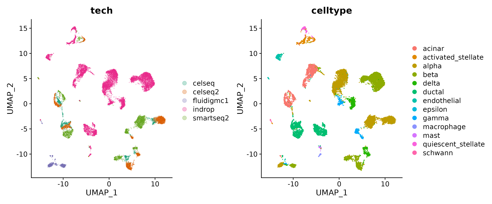
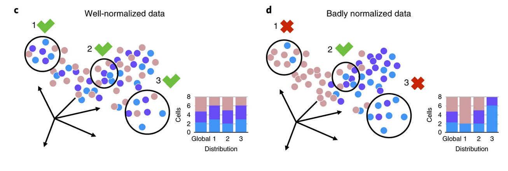

## Outline

- Setup
- Sources of batch effects
- Dataset
- Detecting batch effects
- Mitigating batch effects
- SessionInfo

## Setup

```{r, setup, include=FALSE}
#.libPaths("/rstudio/sikora/rstudio/R/workbench-library/4.1")
.libPaths()
library(formatR)
library(knitr)
library(magrittr)
library(RColorBrewer)
knitr::opts_chunk$set(fig.width=6, fig.height=5,message=FALSE,warning=FALSE,tidy=TRUE, tidy.opts=list(width.cutoff=70)) 
```

```{r seuratVersion,warning=FALSE,message=FALSE}
library(Seurat)
packageVersion("Seurat")
```

## Sources of batch effects

Multiple steps in sample preparation introduce changes to measured gene expression. Some of these are:

- Cell/RNA isolation (e.g. FACS)
- Library construction
- Sequencing run
- Sequencing technology
- Individual (patient sample)
- The person performing the experiment


## Problem description

We're going to work with a dataset comprised of pancreatic cells sequenced with 4 different single cell technologies, with various numbers of replicates. We're first going to inspect the lowD embedding of the full dataset, and then we're going to work with a subset of the full dataset. We're going to inspect and attempt to mitigate known batch effects in the subset dataset.


## What does the data look like out of the box?

Lets have a look at the UMAP embedding of the full dataset processed in a standard way, ignoring any possible batch effects. Compare the cell separation by sequencing technology and by cell type.




## Load the preprocessed subset dataset 

We have subset and pre-processed the full dataset for you. You can download it from `zenodo`.


```{r load_subset}
forig <- "https://zenodo.org/record/7891484/files/panc_sub_processed.RDS?download=1"
fdest <-"datasets/preprocessed_rds/panc_sub_processed.RDS"

if (!file.exists(fdest)){ utils::download.file(forig,destfile=fdest,method="wget") }
panc_sub <- readRDS(fdest)
table(panc_sub$dataset)
```

**Poll:** Which sequencing technologies are retained in the subset dataset?


## Revisit UMAP

Plot UMAP embedding for the subset dataset. Inspect the cell separation by cell type and by sequencing technology.

```{r umap_sub, echo=FALSE,fig.width=12,fig.show='hold',fig.align='center'}
my_cols <- brewer.pal(panc_sub@meta.data$tech %>% unique() %>% length(),"Dark2")

p1<-DimPlot(panc_sub, reduction = "umap", group.by="tech", cols=scales::alpha(my_cols,0.3))
p2<-DimPlot(panc_sub, reduction = "umap", group.by="celltype")
p1+p2
```

## How do we measure batch effects?

We can see various amounts of batch effect by eye. Let's try to calculate some metrics using the `kBET` package from Theis lab.

{width=80%,height=80%}

The algorithm creates k-nearest neighbour matrix and choses 10% of the samples to check the batch label distribution in its neighbourhood. If the local batch label distribution is sufficiently similar to the global batch label distribution, the -test does not reject the null hypothesis (that is "all batches are well-mixed"). The result of kBET is the average test rejection rate. The lower the test result, the less bias is introduced by the batch effect. kBET is very sensitive to any kind of bias. If the batch size is large, we recommend to subsample the data.

In addition to kBET rejection rate, we're going to inspect the degree of batch effect by leveraging PCA.


## Run kBET

Kbet returns a summary of hypothesis rejection rate for a number of dataset subsets (100 by default). The null hypothesis is that the distribution of batch labels in a cell's neighbourhood is not different than the global distribution of batch labels. The expected rejection rate reflects the null hypothesis. The observed rejection rate is compared to the expected one by a chi-square test.

We're going to use the `@scale.data` slot of the `RNA` assay to compute the batch effect metrics.

```{r kBET1}
library(kBET)
library(ggplot2)

d <- GetAssayData(panc_sub,slot="scale.data",assay="RNA") %>% as.matrix() %>% t() 
b <- panc_sub$tech   # technical batch = dataset

batch.estimate <- kBET(df=d, batch=b, plot=FALSE) 


plot.data <- data.frame(class=rep(c('observed', 'expected'), 
                                  each=length(batch.estimate$stats$kBET.observed)), 
                        data =  c(batch.estimate$stats$kBET.observed,
                                  batch.estimate$stats$kBET.expected))
```

## Plot the rejection rate


```{r kBET1_plot,fig.width=4, fig.height=3}
g <- ggplot(plot.data, aes(class, data)) + geom_boxplot() + 
  labs(x='Test', y='Rejection rate',title='kBET test results') +
  theme_bw() +  
  scale_y_continuous(limits=c(0,1))

g
```

## Is the measured batch effect significant?

```{r kBET2}
batch.estimate$summary
batch.estimate$average.pval
```
The observed rejection rate is near 1 (100%). Knowing that kBET is very sensitive, we're going to include a PC analysis, additionally. 

## Which PC is the major source of batch effect?

We are going to use the pcRegression function from the kBET package to correlate the batch vector with the principal components of the dataset. As this function accepts prcomp-style input, we're going to recompute the PCs with the `prcomp` function.

```{r kBET3.1}
#the data is already centered and scaled
#pca.data <- prcomp(d, center=FALSE)
pca.data<-list("x"=Embeddings(panc_sub,reduction="pca"),"sdev"=Stdev(panc_sub, reduction = "pca"))
batch.pca <- pcRegression(pca.data, b)
before<-batch.pca["r2"]
```

Have a look at the head of the result.
Let's look at how high the correlation coefficient is with any PC:

```{r kBET3.2}
before$r2[which.max(before$r2[,"R.squared"]),]

```
## Inspect the result

Which PC has the highest R.squared to the batch variable?

```{r kBET3_whichmax}

which.max(before$r2[,"R.squared"])

```

**Poll** Which principal component is most highly correlated with the batch variable?


Since we have recalculated the PCs with a different package, we might want to identify the closest PC calculated by Seurat.

```{r kBET3.3,eval=FALSE,echo=FALSE}
#fist check which the corresponding component in Seurat Embeddings is
pe<-Embeddings(panc_sub,reduction="pca")
n<-names(which.max(before$r2[,"R.squared"]))
pca.cor<-apply(pe,2,function(X)cor(abs(X),abs(pca.data$x[,n])))
sum(pca.cor>0.5) #let's make sure we are looking at meaningful correlations
n_seurat<-names(which.max(pca.cor))
n_seurat
```

We can now plot this component on the feature plot and compare it with the cell technology label distribution.

```{r kBET3.4,fig.width=6,fig.height=10}
n_seurat<-names(which.max(before$r2[,"R.squared"]))
p1<-FeaturePlot(panc_sub,features=n_seurat)
p2<-DimPlot(panc_sub, reduction = "umap", group.by="tech", cols=scales::alpha(my_cols,0.3))
p1+p2
```

It is apparent that `r n_seurat`` partially differentiates cells sequenced with smartseq2 technology from those sequenced with celseq2. 

## Task: plot gene expression

In the previous course units, you have learned to call differentially expressed genes with Seurat. In this task, we ask you to:
- call genes differentially expressed between cells sequenced with the smartseq2 technology and those with the celseq technology
- plot a violin plot for the top gene
- plot a feature plot for the top gene

**Poll** What is the name of the top DE gene ?


Here's our proposed solution:

```{r solution_DEG_before}
smartseq2.markers <- FindMarkers(panc_sub, ident.1 = "smartseq2", ident.2 = "celseq", only.pos = TRUE)
VlnPlot(panc_sub, features = "LRRC75A-AS1",group.by="celltype",split.by="tech")

```

This gene appears to be mostly expressed in cells sequenced with the smartseq2 technology in multiple cell populations.

Let's plot it's expression on the lowD embedding:

```{r DEG_before_umap,fig.width=6,fig.height=10}
p1<-FeaturePlot(panc_sub,features="LRRC75A-AS1")
p2<-DimPlot(panc_sub, reduction = "umap", group.by="tech", cols=scales::alpha(my_cols,0.3))
p1+p2
```

## What options are there to mitigate batch effects ?

Let's now explore some options of mitigating batch effects:

- Seurat Integration
- Seurat SCTransform
- Conos
- Harmony
- ComBat/SVA
- ...

## Seurat Integration: theory

{width=70%,height=70%}

Seurat authors developed a strategy to "anchor" diverse datasets together:
- Joint dimentional reduction
- Mutual nearest neighbours ("anchors")
- Filter for high-scoring anchors
- Known bottleneck: rare cell types


## Seurat Integration: prep datasets

Prior to the integration, we want to normalize each dataset to be integrated separately.

```{r seurat_integrate1}
# split the dataset into a list of seurat objects 
panc.list <- SplitObject(panc_sub, split.by = "dataset")

# normalize and identify variable features for each dataset independently
panc.list <- lapply(X = panc.list, FUN = function(x) {
    x <- NormalizeData(x)
    x <- FindVariableFeatures(x, selection.method = "vst", nfeatures = 2000)
})
```

## Seurat Integration

In this paragraph, we're going to run the three functions key to Seurat Integration.

```{r seurat_integrate2}
# select features that are repeatedly variable across datasets for integration
features <- SelectIntegrationFeatures(object.list = panc.list)

anchors <- FindIntegrationAnchors(object.list = panc.list, anchor.features = features)

# this command creates an 'integrated' data assay
panc.combined <- IntegrateData(anchorset = anchors)

```

Let's have a brief look at the panc.combined dataset - a new Assay has been created by the integration procedure.

**Poll** What is the new assay called? Hint: you can access assays of a Seurat object with `Assays()`.


## Process the newly integrated dataset

After the integration, data scaling on the new assay is necessary, as well as calculation of PCA and UMAP embeddings.

```{r process_integrated}
# specify that we will perform downstream analysis on the corrected data note that the
# original unmodified data still resides in the 'RNA' assay
DefaultAssay(panc.combined) <- "integrated"

# Run the standard workflow for visualization and clustering
panc.combined <- ScaleData(panc.combined, verbose = FALSE)
panc.combined <- RunPCA(panc.combined, npcs = 30, verbose = FALSE)
panc.combined <- RunUMAP(panc.combined, reduction = "pca", dims = 1:30)

```

## What does the data look like after the integration?

Let's have a look at the distribution of celltype and technology labels in lowD after integration.

```{r integrated_umap, echo=FALSE,fig.width=12,fig.show='hold',fig.align='center',fig.cap=c("By technology.","By cell type.")}
p1<-DimPlot(panc.combined, reduction = "umap")
p2<-DimPlot(panc.combined, reduction = "umap",group.by="celltype")
p1+p2
```

We can also compare the distribution of cell tech labels before and after integration.

```{r b_a_umap, echo=FALSE,fig.width=12,fig.show='hold',fig.align='center',fig.cap=c("Before.","After.")}
p1<-DimPlot(panc_sub, reduction = "umap")
p2<-DimPlot(panc.combined, reduction = "umap")
p1+p2
```

## What does the batch effect look like after the integration?

We can see that the cells from different datasets overlap, and there appears to be one major cluster per cell type. Let's use kBET again to see what kind of metrics it returns.   
We will start by taking the `@scale.data` slot of the `integrated` assay.

```{r integrated_kBET1}
d <- GetAssayData(panc.combined, slot="scale.data", assay="integrated") %>% as.matrix() %>% t() 
b <- panc.combined$dataset

batch.estimate <- kBET(df=d, batch=b, plot=FALSE)

plot.data <- data.frame(class=rep(c('observed', 'expected'), 
                                  each=length(batch.estimate$stats$kBET.observed)), 
                        data =  c(batch.estimate$stats$kBET.observed,
                                  batch.estimate$stats$kBET.expected))
```


## Inspect the result

```{r integrated_kBET1_plot,fig.width=4, fig.height=3}
  g <- ggplot(plot.data, aes(class, data)) + geom_boxplot() + 
  labs(x='Test', y='Rejection rate',title='kBET test results') +
  theme_bw() +  
  scale_y_continuous(limits=c(0,1))

g
```

Surprisingly, kBET returns an almost unchanged hypothesis rejection rate for the integrated dataset.
Since it is known, that kBET is quite sensitive, we're going to include the PC analysis again.


## Principal component correlation with the batch variable

Let's recalculate the PCs with the `prcomp` function again and correlate them with the batch variable.

```{r integrated_kBET3.1}
#the data is already centered and scaled
#pca.data <- prcomp(d, center=FALSE)
pca.data<-list("x"=Embeddings(panc.combined,reduction="pca"),"sdev"=Stdev(panc.combined, reduction = "pca"))
batch.pca <- pcRegression(pca.data, b)
after<-batch.pca["r2"]
```

How high does the correlation coefficient get?

```{r integrated_kBET3.2}
after$r2[which.max(after$r2[,"R.squared"]),]
```
Let's look at the rank of the most highly correlated PC.

```{r integrated_kBET3_inspect}
which.max(after$r2[,"R.squared"])
```
**Poll** What is the rank of the most highly correlated PC ? 

This PC is unlikely to be taken into account in Seurat clustering or lowD embedding, as this is typically using 20-50 top PCs.
Although the kBET rejection rate is still high after integration, the rank of the PC most correlated with the batch variable is now very low.


Let's have a look at the correlation of this PC with the top50 Seurat PCs.

```{r kBET3_integrated_plot,echo=FALSE,eval=FALSE}
#fist check which the corresponding component in Seurat Embeddings is
pe<-Embeddings(panc.combined,reduction="pca")
n<-names(which.max(after$r2[,"R.squared"]))
pca.cor<-apply(pe,2,function(X)cor(abs(X),abs(pca.data$x[,n])))
sum(pca.cor>0.5)

```

**Poll** How many of the top50 Seurat PCs have a correlation coeficient greater that 0.5 with the `prcomp PC1893` ?


## Distribution of the correlation coeficients before and after integration

We can also summarize the distribution of correlation coeficients for the top 50 `prcomp` PCs for the dataset before and after integration:

```{r r2_hist,out.width="100%"}
par(mfrow=c(1,2))
hist(before$r2[,"R.squared"],xlim=c(0,1),breaks=100,main=sprintf("Before batch \n effect removal"),xlab="R.squared")
hist(after$r2[,"R.squared"],xlim=c(0,1),breaks=100,main=sprintf("After batch \n effect removal"),xlab="R.squared")
par(mfrow=c(1,1))

```

Applying integration to the panc dataset clearly reduced the correlation of the top50 `prcomp` PCs with the batch variable.


## Outlook

- Verify that expected marker genes are expressed per cell population
- Note: Seurat v5 has additional modalities of integrating cells: (Harmony and scVI, bridge integration across modalities)
- Note: kBET rejection rate before and after integration varies from dataset to dataset. It is still worth inspecting it on another piece of data, even though it wasn't showing much reduction in the dataset chosen for this vignette.

## SessionInfo

```{r sessionInfo}
sessionInfo()
```

## Citations

Büttner, M., Miao, Z., Wolf, F.A. et al. A test metric for assessing single-cell RNA-seq batch correction. Nat Methods 16, 43–49 (2019). https://doi.org/10.1038/s41592-018-0254-1  

Stuart T, Butler A, Hoffman P, Hafemeister C, Papalexi E, Mauck WM 3rd, Hao Y, Stoeckius M, Smibert P, Satija R. Comprehensive Integration of Single-Cell Data. Cell. 2019 Jun 13;177(7):1888-1902.e21. doi: 10.1016/j.cell.2019.05.031. Epub 2019 Jun 6. PMID: 31178118; PMCID: PMC6687398

## Appendix

This is how to reproduce generation of the UMAP embedding for the full dataset and further the generation of the subset dataset used in this course unit:

```{=html}
<code>
library(SeuratData)
panc <- LoadData("panc8", type = "default")
table(panc$dataset)
panc <- NormalizeData(panc)
panc <- FindVariableFeatures(panc, selection.method = "vst", nfeatures = 2000)
all.genes <- rownames(panc)
panc <- ScaleData(panc, features = all.genes)
panc <- RunPCA(panc, features = VariableFeatures(object = panc))
panc <- RunUMAP(panc, dims = 1:15)
p1<-DimPlot(panc, reduction = "umap",label=TRUE)
p2<-DimPlot(panc, reduction = "umap",group.by="celltype")
p1+p2

panc_sub <- subset(x=panc,subset = dataset == c("celseq","celseq2","smartseq2"))
panc_sub <- NormalizeData(panc_sub)
panc_sub <- FindVariableFeatures(panc_sub, selection.method = "vst", nfeatures = 2000)
all.genes <- rownames(panc_sub)
panc_sub <- ScaleData(panc_sub, features = all.genes)
panc_sub <- RunPCA(panc_sub, features = VariableFeatures(object = panc_sub))
panc_sub <- RunUMAP(panc_sub, dims = 1:15)
saveRDS(panc_sub,"panc_sub_processed.RDS")
</code>
```
