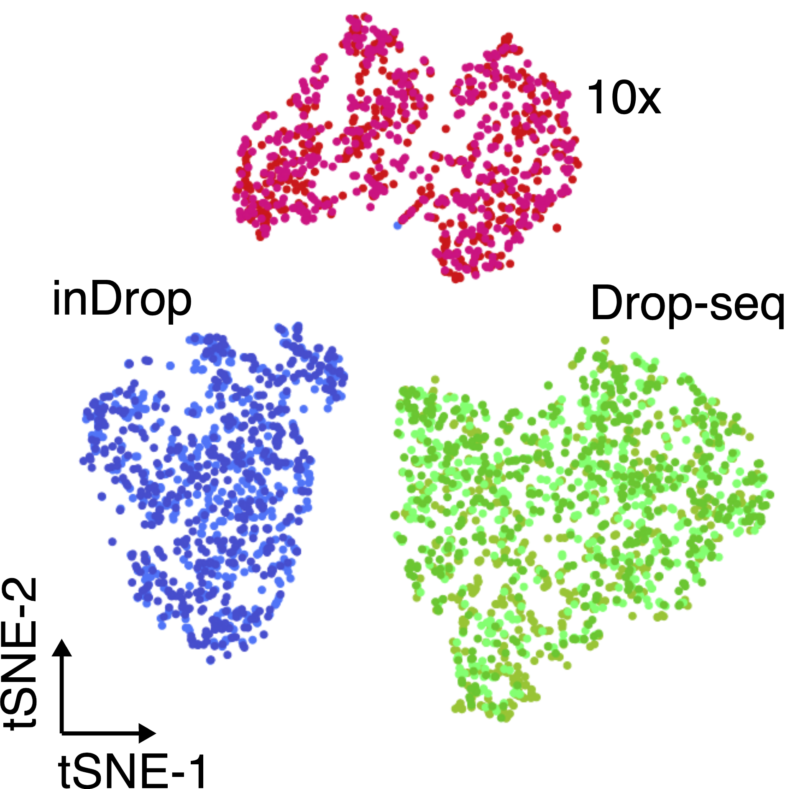

```{r setup, include=FALSE}
knitr::opts_chunk$set(echo = TRUE)
```

> Please note: this is a summary of the information available at: <https://www.singlecellcourse.org/>

#### Why do we need Single Cell RNA sequencing?

With bulk RNA-seq we can only estimate the **average expression level** for each gene across a population of cells, without regard for the heterogeneity in gene expression across individual cells of that sample. Therefore, it is insufficient for studying heterogeneous systems, e.g. early development studies or complex tissues such as the brain.

```{r, echo=FALSE, fig.cap="Broad comparison of bulk vs single-cell RNA-seq ([source](https://technologynetworks.com))."}

```

One salient use-case for single-cell RNA-seq is building comprehensive compendium(s) of the cell diversity in organism(s):

Here is a non-exhaustive list of some of these projects:

- [Human Cell Atlas (H. sapiens)](https://www.humancellatlas.org/)
- [Tabula Muris (M. musculus)](https://tabula-muris.ds.czbiohub.org/)
- [Fly Cell Atlas (D. melanogaster)](https://flycellatlas.org/)
- [Cell Atlas of Worm (C. elegans)](https://atlas.gs.washington.edu/worm-rna/)
- [Arabidopsis Root Atlas (A. thaliana)](https://bioit3.irc.ugent.be/plant-sc-atlas/root)

#### Does it have lower throughput than bulk?

Depends. Since 2009, single-cell protocols are showing an increase in the throughput, going from tens to millions of cells in just over a decade. ([source](https://arxiv.org/abs/1704.01379))

```{r, echo=FALSE, fig.cap="Comparison of common scRNA-seq protocols ([source](https://doi.org/10.1146/annurev-biodatasci-080917-013452)). Abbreviations: cDNA, complementary DNA; DNA pol I, DNA polymerase I; FACS, fluorescence-activated cell sorting; PCR, polymerase chain reaction; RNase H, ribonuclease H; RT, reverse transcription; TSO, template-switching oligonucleotide."}

```

#### What protocol should I choose?

The most suitable platform depends on the biological question at hand. For example, if one is interested in characterizing the composition of a **heterogeneous tissue, then a droplet-based method** is more appropriate, as it allows a very large number of cells to be captured in a mostly unbiased manner. On the other hand, if one is interested in characterizing a specific cell-population for which there is a known surface marker, then it is probably best to enrich using FACS and then sequence a smaller number of cells at higher sequencing depth.

Clearly, full-length transcript quantification will be more appropriate if one is interested in studying different isoforms, since tagged protocols are much more limited in this regard. By contrast, UMIs can only be used with tagged protocols and they can improve gene-level quantification.

**If one is interested in rare cell types (for which known markers are not available), then more cells need to be sequenced, which will increase the cost of the experiment. A useful tool to estimate how many cells to sequence has been developed by the Satija Lab: https://satijalab.org/howmanycells/.**

Besides differences in throughput and sensitivity between protocols, cost may also be a deciding factor when planning a scRNA-seq experiment. It is difficult to precisely estimate how much an experiment will cost, although we point to this tool from the Satija Lab as a starting point: https://satijalab.org/costpercell/. For example, some droplet-based protocols such as Drop-seq are cheaper than the commercial alternatives such as 10x Chromium.

<!-- Methods such as cell hashing (Stoeckius et al.) may further reduce the costs of sequencing using current platforms. This method in particular consists of attaching oligo-tags to cell membranes, allowing more cells from multiple samples to be loaded per experiment, which can later be demultiplexed during the analysis. -->

##### Takeaway

> **SMART-seq2** is a popular low-throughput method, providing full-length transcript quantification. It is ideally suited for studying a smaller group of cells in greater detail (e.g. differential isoform usage, characterisation of lowly-expressed transcripts).
>
> **10x Chromium** is a popular high-throughput method, using UMIs for transcript quantification (from either 3’ or 5’ ends). It is ideally suited to study highly heterogeneous tissues and sample large populations of cells at scale.

#### Challenges

The main difference between bulk and single cell RNA-seq is that each sequencing library represents a single cell, instead of a population of cells. Therefore, there is no way to have "biological replicates" at a single-cell level: **each cell is unique and impossible to replicate.** Instead, cells can be clustered by their similarity, and comparisons can then be done across groups of similar cells. _This is were clustering algorithms come in._

Another big challenge in single-cell RNA-seq is that we have a very low amount of starting material per cell. This results in **very sparse data, where most of the genes remain undetected** and so our data contains many zeros. These may either be due to the gene not being expressed in the cell (a "real" zero) or the gene was expressed but we were unable to detect it (_a "dropout"_).

This leads to cell-to-cell variation that is not always biological but rather due to technical issues caused by **uneven PCR amplification across cells and gene "dropouts"** (where a gene is detected in one cell but absent from another, [source](https://doi.org/10.1038/nmeth.2967)). Improving the transcript capture efficiency and reducing the amplification bias are solutions for these problems and still active areas of technical research. However, as we shall see in this course, _it is possible to alleviate some of these issues through proper data normalization_.

Another important aspect to take into account are **batch effects**. These can be observed even when sequencing the same material using different technologies (figure below), and if not properly normalized, can lead to incorrect conclusions.

```{r, echo=FALSE, out.width="50%", fig.cap="The same cell population was sequenced with three different single-cell protocols (colours). ([source](https://doi.org/10.1016/j.molcel.2018.10.020))"}

```

The processing of samples should also be done in a manner that avoids confounding between experimentally controlled variables (such as a treatment, a genotype or a disease state) and the time when the samples are prepared and sequenced. **For example**, if planning an experiment to compare healthy and diseased tissues from 10 patients each, if only 10 samples can be processed per day, it is best to do 5 healthy + 5 diseased together each day, rather than prepare all healthy samples one day and all diseased samples in another (figure below).

Another consideration is to ensure that there is replication of tissue samples. **For example**, when collecting tissue from an organ, it may be a good idea to take multiple samples from different parts of the organ. Or consider the time of day when samples/replicates are collected (due to possible circadian changes in gene expression).

**In summary, all the common best practices in experimental design should be taken into account when performing scRNA-seq.**

```{r, echo=FALSE, fig.cap="Illustration of a confounded (top panels) and balanced (bottom panels) designs. Shapes denote different sample types (e.g. tissues or patients) and colours processing batches. In the confounded design it’s impossible to disentangle biological variation from variation due to the processing batch. In the balanced design, by using tissue replicates and mixing them across batches, it is possible to distinguish between biological and batch-related variation. ([source](https://doi.org/10.1093/biostatistics/kxx053))"}

```
