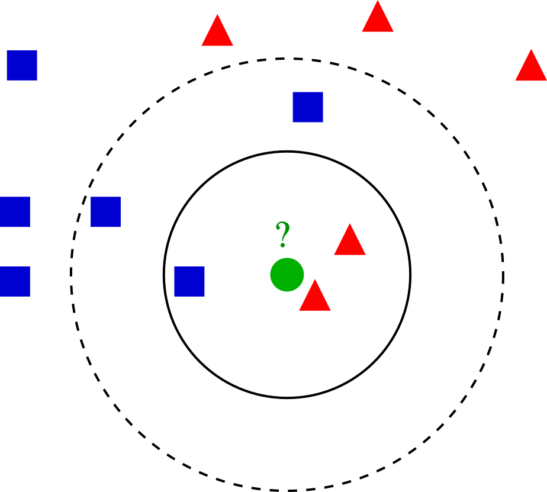

# Setup

<link rel="stylesheet" href="headers.css">

::: {.alert .alert-dismissible .alert-warning}
<h4 class="alert-heading">

Note for Workbench users

</h4>

<p class="mb-0">

If you have chosen to use the common library sitting at <code>/scratch/local/rseurat/pkg-lib-4.2.3</code>, and the following code block fails (after uncommenting the first line).
Try this: restart R (<code>Ctrl+Shift+F10</code>), and then execute in the Console directly (no code block this time):

<code class="sourceCode r">.libPaths(new="/scratch/local/rseurat/pkg-lib-4.2.3")</code>

<br />This (incl. restart) may be run up to two times, we did had the unexpected experience were this was the case... 🤷

</p>
:::

```{r setup}
#.libPaths(new = "/scratch/local/rseurat/pkg-lib-4.2.3")

suppressMessages({
  library(tidyverse)
  library(Seurat)
})


set.seed(8211673)

knitr::opts_chunk$set(echo = TRUE, format = TRUE, out.width = "100%")


options(
  parallelly.fork.enable = FALSE,
  future.globals.maxSize = 8 * 1024^2 * 1000
)

plan("multicore", workers = 8) # function made available by SeuratObj automatically.

eval_scratch<-dir.exists("/scratch/local")

```

```{r run-mpi, echo=FALSE,eval=eval_scratch}
wdir<-paste0("/scratch/local/",system('echo $USER',intern=TRUE),"/Rseurat/")
system(paste0('mkdir -p ',wdir))
setwd(wdir)
knitr::opts_knit$set(root.dir = wdir)
```

```{r run-anycase}
cat("work directory: ", getwd())
cat("\n")
cat("library path(s): ", .libPaths())
system('mkdir -p datasets/preprocessed_rds')
```

# Load Data

We will be analyzing a dataset of Peripheral Blood Mononuclear Cells (PBMC) freely available from 10X Genomics.
There are 2700 single cells that were sequenced with Illumina and aligned to the human transcriptome.

For further details on the primary analysis pipeline that gives you the count data, please head over to [cellranger website](https://support.10xgenomics.com/single-cell-gene-expression/software/pipelines/latest/what-is-cell-ranger).

The raw data can be found [here](https://cf.10xgenomics.com/samples/cell/pbmc3k/pbmc3k_filtered_gene_bc_matrices.tar.gz), and you have already downloaded it with the repository Zip file.
This dataset consists of 3 files:

-   `matrix.mtx`: **count matrix** represents the number of molecules for each gene (row) that are detected in each cell (column).
-   `genes.tsv`: a list of ENSEMBL-IDs and their corresponding gene symbol
-   `barcodes.tsv`: a list of molecular barcodes that identifies each cell uniquely

For now we assume that this data resides in a directory `datasets/filtered_gene_bc_matrices/hg19` (relative to this current markdown file).
We can read this with a single command:

```{r read10x}
pbmc.data <- Read10X(data.dir = "./datasets/filtered_gene_bc_matrices/hg19/")
```

This data is extremely big and sparse, this variable is now an object of type `dgCMatrix`.
Lets examine a few genes in the first thirty cells:

```{r explore1}
pbmc.data[c("CD3D", "TCL1A", "MS4A1"), 1:30]
```

And, we can have a heatmap of the first few genes and cells:

```{r explore2, echo=FALSE, out.width="50%"}
pheatmap::pheatmap(log10(pbmc.data[1:500, 1:200] + 1),
  show_rownames = F,
  show_colnames = F,
  cluster_rows = F,
  cluster_cols = F,
  color = colorRampPalette(
    c("lightgrey", "red")
  )(100)
) # note: colorRampPalette returns another function.
```

> 🧭✨ Polls:
>
> How many genes and cells does this dataset have? https://PollEv.com/multiple_choice_polls/SUGa0Gd6arc2yN03oGsW6/respond
>
> How many genes are not expressed in any cell? https://PollEv.com/multiple_choice_polls/7eG9v27igQJ4q3YXkEC9n/respond
> Hint: subset genes with `rowSums()`.
>
> Which are the top 3 genes with the highest total count? https://PollEv.com/multiple_choice_polls/N95CXZgAjezf5VQlH8QO7/respond
> Hint: `rowSums()` and `sort`.

> ⌨🔥 Exercise: Plot the histogram of counts for the previous top gene over all cells

# Seurat Object

Initialize the Seurat object with the raw (non-normalized data):

```{r createSeurat}
(
  pbmc <-
    CreateSeuratObject(
      counts = pbmc.data,
      project = "pbmc3k",
      min.cells = 3,
      min.features = 200
    ) %>% suppressWarnings()
) # extra outer pair of parenthesis mean 'print()'
```

> **Note:** usually on any data science context, we refer to our columns as features.
> This is not the case for the count matrix.

The `min.cells` and `min.features` arguments are first low-stringency **filters**.
We are only loading cells with at least 200 genes detected, and we are only including those genes (features) that were detected in at least 3 cells.

With these filters in this particular dataset, we are reducing the number of genes from `33000` to `14000`.

The `SeuratObject` serves as a container that contains both data (like the count matrix) and analysis (like PCA, or clustering results) for a single-cell dataset.
For example, the count matrix is stored in `pbmc[["RNA"]]@counts`.
On RStudio, you can use `View(pbmc)` to inspect all the slots.

> 🧭✨ Poll:
>
> In cell "AAATTCGATTCTCA-1", how many reads map to gene "ACTB"?
> Hint: subset the assay data, `pbmc@assays$RNA`.

At the top level, `SeuratObject` serves as a collection of `Assay` and `DimReduc` objects, representing expression data and dimensional reductions of the expression data, respectively.
The `Assay` objects are designed to hold expression data of a single type, such as RNA-seq gene expression, CITE-seq ADTs, cell hashtags, or imputed gene values.

On the other hand, `DimReduc` objects represent transformations of the data contained within the Assay object(s) via various dimensional reduction techniques such as PCA.
For class-specific details, including more in depth description of the slots, please see the wiki sections for each class:

-   [`Seurat`](https://github.com/satijalab/seurat/wiki/Seurat)

    -   [Slots](https://github.com/satijalab/seurat/wiki/Seurat#slots)
    -   [Object Information](https://github.com/satijalab/seurat/wiki/Seurat#object-information)
    -   [Data Access](https://github.com/satijalab/seurat/wiki/Seurat#data-access)

-   [`Assay`](https://github.com/satijalab/seurat/wiki/Assay)

    -   [Slots](https://github.com/satijalab/seurat/wiki/Assay#slots)
    -   [Object Information](https://github.com/satijalab/seurat/wiki/Assay#object-information)
    -   [Data Access](https://github.com/satijalab/seurat/wiki/Assay#data-access)

-   [`DimReduc`](https://github.com/satijalab/seurat/wiki/DimReduc)

    -   [Slots](https://github.com/satijalab/seurat/wiki/DimReduc#slots)
    -   [Object Information](https://github.com/satijalab/seurat/wiki/DimReduc#object-information)
    -   [Data Access](https://github.com/satijalab/seurat/wiki/DimReduc#data-access)

# Quality Control

One of our first goals is to identify (and filter) dead cells that could be the results of a harsh experimental protocol.
A few QC metrics commonly used, include:

1.  **The number of unique genes detected in each cell.**

-   Low-quality cells or empty droplets will often have very few genes.
-   Cell doublets or multiplets may exhibit an aberrant high gene count.

1.  Similarly, **the total number of molecules detected within a cell (correlates strongly with unique genes)**
2.  **The percentage of reads that map to the mitochondrial genome.**

-   Low-quality / dying cells often exhibit extensive mitochondrial contamination.
-   We use the set of all genes starting with MT- as a set of mitochondrial genes.

For further details, see [this publication](https://www.ncbi.nlm.nih.gov/pmc/articles/PMC4758103/).

The number of unique genes and total molecules are automatically calculated during `CreateSeuratObject()`.
You can find them stored in the object `meta.data`, let's see for the first 5 cells:

```{r metadata}
pbmc@meta.data %>% head(5)
```

The `@` operator we just used, is for accessing the slot on the object.

The `[[` operator can add columns to object metadata.
This is a great place to stash additional QC stats:

```{r getMT}
pbmc[["percent.mt"]] <- PercentageFeatureSet(pbmc, pattern = "^MT-")
```

`PercentageFeatureSet()` function calculates the percentage of counts originating from a set of features.
In the example above we can easily access all miochondrial genes because their names start with "\^MT".
So we give this as pattern (aka *regular expression*).

Let's visualize the distribution of these metrics over all cells (as Violin plots):

```{r vlnplot}
VlnPlot(
  pbmc,
  features = c("nFeature_RNA", "nCount_RNA", "percent.mt"),
  ncol = 3,
  layer = "counts"
)
```

The `VlnPlot()` function plots the probability density function for all the specified variables (features).

> 🧭✨ Poll: How many cells have less than 2000 counts in total (summed over all genes)?
> Hint: use `colSums`.

Individually these variables may not fully discriminate dead cells, but could also reflect real biological properties (e.g. higher mitochondrial count).
Therefore it is useful to look a relationship between these variables.
`FeatureScatter()` is typically used to visualize relationships between features, but it can also be used for anything calculated at the object, i.e. columns in object metadata or for genes (rows in the count matrix).
All those are **features**

```{r featurescatter}
plot1 <- FeatureScatter(pbmc, feature1 = "nCount_RNA", feature2 = "percent.mt") + NoLegend()
plot2 <- FeatureScatter(pbmc, feature1 = "nCount_RNA", feature2 = "nFeature_RNA") + NoLegend()
plot3 <- FeatureScatter(pbmc, feature1 = "nCount_RNA", feature2 = "ACTB", slot = "counts") + NoLegend()
plot1 + plot2
plot3
```

# Filtering and Transformation

## Select Cells

Based on cell-specific features we can subset our `SeuratObject` to keep only the 'cells' in good state.
In this case, based on the previous Violin plots, we'll use the following criteria:

-   Unique feature counts over 2500 or below 200.
-   $>5%$ mitochondrial counts.

```{r filter, echo=FALSE}
pbmc <- pbmc %>% subset(nFeature_RNA > 200 &
  nFeature_RNA < 2500 &
  percent.mt < 5)
```

> 🧭✨ Poll: What's the current number of cells after this step?

## Normalization

After removing unwanted cells from the dataset, the next step is to normalize the data.
By default, we employ a global-scaling normalization method "LogNormalize" that normalizes the feature expression measurements for each cell by the total expression, multiplies this by a scale factor (10000 by default), and log-transforms the result.
Normalized values are stored in `pbmc[["RNA"]]@data`.

```{r norm}
pbmc <- NormalizeData(pbmc)
```

## Informative Genes

The main goal is to select genes that will help us to organize cells according to the transcription profile, this are the genes that will be in the spotlight for our following step.
Therefore we look for a subset of genes ("features") that exhibit high cell-to-cell variation in the dataset (i.e, they are highly expressed in some cells, and lowly expressed in others).

To identify the most highly variable genes, Seurat models the mean-variance relationship inherent in the data using the `FindVariableFeatures()` function.
By default, it uses the `vst` methodology with 2000 features per dataset.

First, fits a line to the relationship of `log(variance)` and `log(mean)` using local polynomial regression (`loess`).
Then standardizes the feature values using the observed mean and expected variance (given by the fitted line).
Feature variance is then calculated on the standardized values after clipping to a maximum (by default, square root of the number of cells).
These will be used downstream in dimensional reductions like PCA.

<!--Some relevant publications for Feature selection and its importance are: [[1](https://www.nature.com/articles/nmeth.2645)], and [[2](https://doi.org/10.1016/j.cell.2019.05.031)].-->

```{r HVG}
pbmc <- FindVariableFeatures(pbmc)
```

<!--Note that there's also the `selection.method = "mvp"` that identifies variable features while controlling for the strong relationship between variability and average expression.-->

> 🧭✨ Polls:
>
> Which are the 3 most highly variable genes?
> Hint: use `VariableFeatures()`.
>
> What's the variance of the gene `PYCARD`?
> hint: use `HVFInfo()`.

Plot variable features:

```{r HVG_plot}
(plot1 <- VariableFeaturePlot(pbmc))
```

Now with labels, taking top10 genes as in the recent question:

```{r HVG_LabelPlot}
(plot2 <-
  LabelPoints(
    plot = plot1,
    points = head(VariableFeatures(pbmc), 10),
    repel = TRUE
  ))
```

## Scaling

Next, we apply a linear transformation ('scaling') that is a standard pre-processing step prior to dimensional reduction techniques like PCA.
The `ScaleData()` function:

-   Shifts the expression of each gene, so that the mean expression across cells is `0`
-   Scales the expression of each gene, so that the variance across cells is `1`. This step gives equal weight in downstream analyses, so that highly-expressed genes do not dominate.
-   more generally one can also model the mean expression as a function of other variables from the metadata, i.e. *regress them out* before scaling the residuals (see: `vars.to.regress`)
-   The results of this are stored in `pbmc[["RNA"]]@scale.data`

```{r scaledata}
pbmc <- ScaleData(pbmc, features = rownames(pbmc))
```

# Dimensional Reduction

Next we perform PCA on the scaled data.
By default, only the previously determined variable features are used as input, but can be defined using features argument if you wish to choose a different subset.

```{r runpca}
pbmc <- RunPCA(pbmc, features = VariableFeatures(object = pbmc))
```

> Do you feel like you need a refresher on PCA?
> check [StatQuest with Josh Starmer video](https://youtu.be/FgakZw6K1QQ) explaining PCA by SVD step by step!
> (duration: 20 minutes)

Examine and visualize PCA results a few different ways:

```{r dimplot}
DimPlot(pbmc, reduction = "pca") + NoLegend()
```

```{r printpca}
print(pbmc[["pca"]], dims = 1:5, nfeatures = 5)
```

```{r vizdimloadings}
VizDimLoadings(pbmc, dims = 1:2, reduction = "pca")
```

In particular `DimHeatmap()` allows for easy exploration of the primary sources of heterogeneity in a dataset, and can be useful when trying to decide which PCs to include for further downstream analyses.
Both cells and features are ordered according to their PCA scores.
Setting cells to a number plots the 'extreme' cells on both ends of the spectrum, which dramatically speeds plotting for large datasets.
Though clearly a supervised analysis, we find this to be a valuable tool for exploring correlated feature sets.

```{r dimheatmap}
DimHeatmap(pbmc, dims = 1:9, cells = 500, balanced = TRUE)
```

To overcome the extensive technical noise in any single gene for scRNA-seq data, Seurat clusters cells based on their PCA scores.
Here each PC essentially represents a 'metagene' that combines information across a correlated gene sets.
The top principal components therefore represent a robust compression of the dataset.

One quick way to determine the 'dimensionality' of the dataset is by eyeballing how the percentage of variance explained decreases:

```{r elbowplot}
ElbowPlot(pbmc)
```

> 🧭✨ Poll: How many components should we choose to include?

When picking the 'elbow' point, remember that **it's better to err on the higher side**!
Also, if your research questions aim towards rare celltypes, you may definitely include more PCs (think about it in terms of the variance in gene expression values).

<!-- Another methodology is using the JackStraw procedure: We randomly permute a subset of the data (1% by default) and rerun PCA, constructing a 'null distribution' of feature scores, and repeat this procedure. We identify 'significant' PCs as those who have a strong enrichment of low p-value features. Of course, such permutations tend to be cumbersome and this is a highly intense computational procedure, so we're skipping it in the course. -->

# Playing around with metadata

Let's have a look again into the values we got in `percent.mt`:

```{r}
hist(pbmc$percent.mt)
```

```{r}
summary(pbmc$percent.mt)
```

Now, let's add a column annotating samples with low, medium or high `percent.mt`

```{r}
pbmc$mt.categories <- NA

pbmc$mt.categories[pbmc$percent.mt <= 1.520] <- "Low"
pbmc$mt.categories[pbmc$percent.mt > 1.520 &
                     pbmc$percent.mt <= 2.591 ] <- "Medium"
pbmc$mt.categories[pbmc$percent.mt > 2.591] <- "High"

stopifnot(all(! is.na(pbmc$percent.mt)))
```

Let's explore what we just did:

```{r mt_categories}
VlnPlot(pbmc,
  features = "percent.mt",
  group.by = "mt.categories",
  sort = "decreasing"
) +
  ggtitle(NULL) + NoLegend()
```

Finally, we are able to plot PCA, and have shape by these categories:

```{r}
DimPlot(pbmc, shape.by = "mt.categories")
```

What about using colors?

To do that, we need to 'speak' to the Seurat function (`DimPlot`) through the `SeuratObj`.
There is a variable (actually, it's a slot) inside it, called `active.ident`.
To access or set this to different values (e.g. metadata columns) we use the `Idents()` function:

```{r}
Idents(pbmc) %>% head(3)
```

By default, all our cells have one single value, that was set while creating the Seurat object in our early steps.

Let's set our new metadata column as the new active identity, and let `DimPlot` play out it's straightforward behavior:

```{r}
Idents(pbmc) <- "mt.categories"

DimPlot(pbmc)
```

**It's important that we keep track of our active identity.**

# Clustering

The next step follow the work pioneered by `PhenoGraph`, a robust computational method that partitions high-dimensional single-cell data into subpopulations.
Building on these subpopulations, `PhenoGraph` authors developed additional methods to extract high-dimensional signaling phenotypes and infer differences in functional potential between subpopulations.
<!-- For details, be sure to check the [research paper](http://www.ncbi.nlm.nih.gov/pubmed/26095251) cited by seurat developers. -->

This subpopulations *could* be of biological relevance, retrieving these is our goal.
The definition of such groupings depend upon the parameters.
This algorithm in particular is the K Nearest Neighbors (KNN) graph that is constructed based on the euclidean distance in PCA space.
For an example of building such a graph, imagine we took only two PCs (principal components) and had such an arrangement of cells like these dots in a 2D plane...

```{r, echo=FALSE}

```

On our example of k-NN classification for a cell highlighted in green color, the test sample (green dot) should be classified either to the group made of blue squares or to the subpopulation of cells here represented in red triangles.
If k = 3 (solid line circle) it is assigned to the red triangles because there are 2 triangles and only 1 square inside the inner circle.
If k = 5 (dashed line circle) it is assigned to the blue squares (3 squares vs. 2 triangles inside the outer circle).

There's a drawback with the 'majority voting' scheme, the assignment of such clusters is biased towards the clusters that have greater number of members (especially when ties start appearing).
For that reason, we'll refine the process by using a graph, where edge weights between any two cells is based on the shared overlap in their local neighborhoods (Jaccard similarity).

$$
J(A,B) = \frac{Intersect(A,B)}{Union(A,B)} = J(B,A)
$$

**If two datasets share the exact same members, their Jaccard Similarity Index will be 1. Conversely, if they have no members in common then their similarity will be 0.**

All the process described before, including the use of Jaccard Similarity Index is performed using the `FindNeighbors()` function, and takes as input the previously defined dimensionality of the dataset (first 10 PCs).
So the KNN is build using multidimensional space, but the rules we just saw for 2D still apply.

> 🧭✨ Poll: Which is the default value of the parameter `K` that Seurat uses?
> Hint: `help` yourselves by reading the docs!

```{r findneighbours}
pbmc <- FindNeighbors(pbmc, dims = seq_len(10))
```

We want to keep our clusters looking natural.
That is, we want to have a modularity optimization on top of all.
For that, we'll use the community search algorithm for graphs called Louvain.
You can read more about it [here](https://scribe.froth.zone/louvain-algorithm-93fde589f58c?gi=8dce35ee2f75), or to read about it being applied to the biological problem at hand look into [this research paper](http://dx.doi.org/10.1088/1742-5468/2008/10/P10008).

The `FindClusters()` function implements this procedure, and contains a `resolution` parameter that sets the 'granularity' of the downstream clustering, with increased values leading to a greater number of clusters.
Usually, setting this parameter between `0.4` and `1.2` returns good results for single-cell datasets of around 3K cells.
You can easily try various values and see how it performs.
Optimal resolution often increases for larger datasets.

```{r findclusters}
pbmc <- FindClusters(pbmc, resolution = 0.5)
```

After this process, we have a new `seurat_clusters` column in our `meta.data` slot.
Also, this is our new active identity!

> 🧭✨ Poll: How many clusters did we find?

> ⌨🔥 Exercise: Plot the PC1 vs. PC2 again, with the newest identities.

<!-- NOTE: The [upcoming v5](https://doi.org/10.1101/2022.02.24.481684) of Seurat will include a new clustering method [(specifically designed for handling data sets with the number of cells in the order of millions.)](https://satijalab.org/seurat/articles/seurat5_sketch_analysis.html) -->

# End

```{r sessionInfo}
sessionInfo()
```
