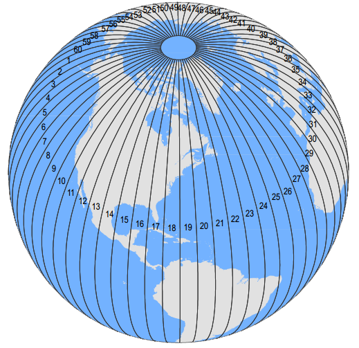

# Setup

```{r setup}
# .libPaths(new = "/scratch/local/rseurat/pkg-lib-4.1.3")

suppressMessages({
  library(tidyverse)
  library(Seurat)
})


set.seed(8211673)

knitr::opts_chunk$set(echo = TRUE, format = TRUE, out.width = "100%")


options(
  parallelly.fork.enable = FALSE,
  future.globals.maxSize = 8 * 1024^2 * 1000
)

plan("multicore", workers = 8)
```

```{r useful-information, echo=FALSE}
cat("work directory: ", getwd())
cat("\n")
cat("library path(s): ", .libPaths())
```

# Load Data

We'll be working with the data from Day 1 ("First steps"), let's quickly re-load and re-process again:

```{r initial, warning=FALSE}
pbmc <- Read10X(data.dir = "./datasets/filtered_gene_bc_matrices/hg19/") %>%
  CreateSeuratObject(counts = ., project = "pbmc3k", min.cells = 3, min.features = 200)

pbmc[["percent.mt"]] <- PercentageFeatureSet(pbmc, pattern = "^MT-")

pbmc <- subset(pbmc, subset = nFeature_RNA > 200 & nFeature_RNA < 2500 & percent.mt < 5)

pbmc <- NormalizeData(pbmc, verbose = FALSE)

pbmc <- FindVariableFeatures(pbmc, verbose = FALSE)

pbmc <- ScaleData(pbmc, features = rownames(pbmc), verbose = FALSE)

pbmc <- RunPCA(pbmc, features = VariableFeatures(pbmc), verbose = FALSE)

pbmc <- FindNeighbors(pbmc, dims = seq_len(10), verbose = FALSE)

pbmc <- FindClusters(pbmc, resolution = 0.5, verbose = FALSE)
```

# Heatmaps

Clusters can be shown on heatmaps:

```{r heatmap, echo=FALSE}
ann <- pbmc@meta.data %>%
  select(seurat_clusters) %>%
  arrange(seurat_clusters)

# extract CELL-PC matrix, subset, transpose, and plot
pbmc@reductions$pca@cell.embeddings[rownames(ann), 1:5] %>%
  t() %>%
  pheatmap::pheatmap(
    cluster_cols = FALSE,
    cluster_rows = FALSE,
    show_colnames = FALSE,
    annotation_col = ann,
    annotation_legend = FALSE
  )
```

# Projections

## PCA: Principal Component Analysis

One key feature of PCA is that it amounts to a **linear** data transformation which preserves distances between all samples (here: cells) by simple rotation in a high dimensional space.
This is useful to identify informative directions and reduce noise (before clustering).
The projection on the first two components is often visualized because those correspond to the directions of maximal variation in the data.
And as we might expect, the different clusters can be seen as --more or less-- separating in this projection:

```{r pca, echo=FALSE}
# easier: DimPlot(pbmc, reduction = "pca")

ggplot(
  pbmc@reductions$pca@cell.embeddings[, 1:2] %>% as.data.frame(),
  aes(
    x = PC_1,
    y = PC_2,
    color = pbmc@meta.data$seurat_clusters
  )
) +
  geom_point() +
  NoLegend()
```

There are other **non-linear** projection techniques that aim specifically to preserve distances between samples in 2 dimensions.
In general this is impossible, but one can at least hope to preserve **local** distances: nearby cells in high dimension will be nearby in 2D.

Consider a simple geographic map, it shares the same goal.
Given its limits, it requires some choices: a sphere cannot be mapped uniquely into 2D.
That is why we have different projections, depicted here is the Universal Mercator Projection.
Each of the 6-degree UTM is the projection on a plane using the geoid shape of our planet.

```{r, echo=FALSE, out.width="49%", out.height="49%", fig.show='hold', fig.align="center"}

knitr::include_graphics("./images/Universe-Transverse-Mercator-Cylinder-678x540.png")
```

For single-cell studies, two methodologies are popular: t-SNE and UMAP.
The second one was developed 10 years later, and it adds a bunch of advantages.

## t-SNE: t-distributed stochastic neighbor embedding

Here the key idea is to first map distances between cells/ samples, $i$ and $j$, to probabilities

-   in high dimensions: $d_{ij} \to p_{ij}$,
-   in low dimensions (2D): $\delta_{ij} \to q_{ij}$

Cells are then iteratively moved around in 2D until $q_{ij} \approx p_{ij}$.

The t- in t-SNE just corresponds to a specific choice of the map $\delta_{ij} \to q_{ij}$ which has proved useful for a wide range of applications.
For further details, see some of these resources:

-   [Google TechTalk](https://www.youtube.com/watch?v=RJVL80Gg3lA&list=UUtXKDgv1AVoG88PLl8nGXmw) (Duration 55 min.)
-   [StatQuest!](https://www.youtube.com/watch?v=NEaUSP4YerM) video (Duration 10 min.)
-   [2019 paper](https://www.nature.com/articles/s41467-019-13056-x) summarizing the challenges of t-SNE for scRNA-seq data.
-   [original paper](https://jmlr.csail.mit.edu/papers/volume9/vandermaaten08a/vandermaaten08a.pdf) from 2008.

The technical details may be challenging, but the execution in Seurat is straightforward.

```{r tsne}
pbmc <- RunTSNE(pbmc)
DimPlot(pbmc, reduction = "tsne")
```

Notice that there are many parameters (with default values) that will affect the visualization.
The most important are: input data and its dimensionality, a seed variable and the **perplexity** (see `?Rtsne::Rtsne` for further details on this.)

> ⌨🔥 Exercise: Find out which parameters are used per default.
> Explore some parameter choices together with your classmates and observe if this will affect the plot.

> 🧭✨ Polls:
>
> Is t-SNE affected by the seed?
>
> According to the docs, perplexity should always follow: `3 * perplexity < nrow(X) -1`.
> Are the rows referring to genes or cells?
> Hint: see description of the matrix `X` in the help of `Rtsne()`...

```{r tsne_stochastic, eval=FALSE}
p1 <- pbmc %>%
  RunTSNE(seed.use = NULL) %>%
  DimPlot(reduction = "tsne")
p2 <- pbmc %>%
  RunTSNE(seed.use = NULL) %>%
  DimPlot(reduction = "tsne")
p1 + p2
```

> **Conclusion:** t-SNE is a stochastic algorithm!!!

## UMAP: Uniform Manifold Approximation and Projection

t-SNE and UMAP have the same principle and workflow: create a high dimensional graph, then reconstruct it in a lower dimensional space while retaining the structure.
While t-SNE moves the high dimensional graph to a lower dimensional space points by points; UMAP compresses that graph.
For further details, see some of these resources:

-   [McInnes et al. 2018](https://arxiv.org/pdf/1802.03426)
-   [Google PAIR](https://pair-code.github.io/understanding-umap/) from Google's People+AI Research (PAIR) initiative.

UMAP has a similar goal as t-SNE; but it also tries to preserve more global aspects of the data structure.
It has several advantages:

-   faster approximation
-   less sensitive to seed
-   **better balance between local and global structure**

Thanks to Seurat, and the underlying package (see `?uwot::umap`), finding and plotting the UMAP projection is also straightforward:

```{r umap, warning=FALSE}
pbmc <- RunUMAP(pbmc, dims = 1:5, verbose = FALSE)
DimPlot(pbmc, reduction = "umap")
```

Unsurprisingly there are again many parameters that can change the visualization.

> ⌨🔥 Exercise: For UMAP, an important parameter is the number of neighbors.
> Play around with a couple of values!

> 🧭✨ Polls:
>
> Run the UMAP without seed a couple of times and compare.
> Is it more affected than t-SNE?
> Or less?
> Hint: use the `seed.use` argument.

### Take Away

```{r}
DimPlot(pbmc, reduction = "umap") + NoLegend() |
  DimPlot(pbmc, reduction = "tsne") + NoLegend()
```

-   Global distances and orientations should not be over-interpreted.
-   We're distorting the data to fit it into lower dimensions. Both algorithms aim to facilitate **visualization**, there is no ground truth.
-   Parameter exploration is allowed, and **very much encouraged**.

## Common Pitfalls to Avoid

1.  Differences in cluster size mean nothing.
2.  Distances between clusters might not mean anything.
3.  You should look to more than one plot, changing its hyperparameters.

# End

> ⌨🔥 Exercise: Distribute the room in groups, and run the algorithms with 2, 5, 8, 12, and/ or 15 PCs.
> Strive to avoid the aforementioned common pitfalls, specially the third one!

> 🧭✨ Polls:
>
> Would decreasing the number of PCs fed onto the clustering algorithm change our visualization?
> Would you say the results are 'better'?
>
> Could you have the UMAP projection onto 3 axis instead of 2?
