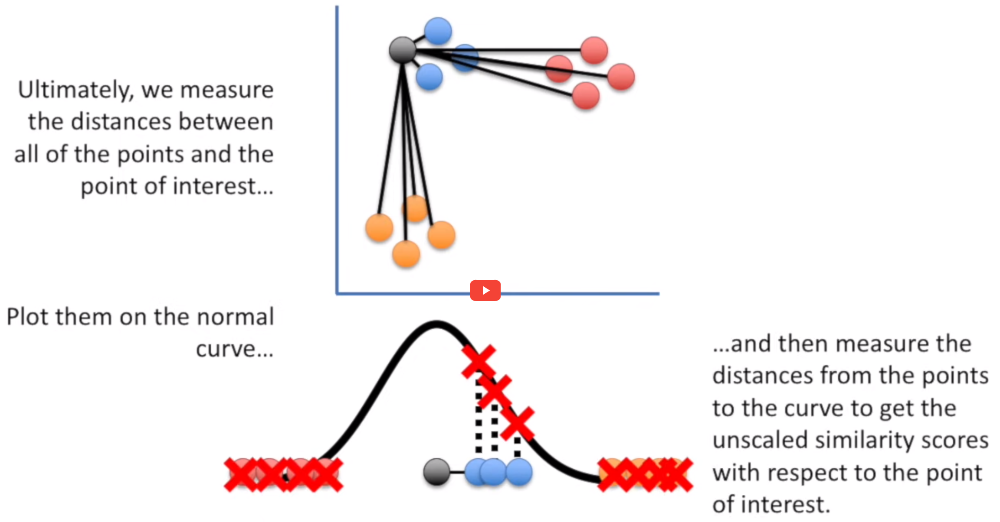

# Setup

<link rel="stylesheet" href="headers.css">

```{r setup}
# .libPaths(new = "/scratch/local/rseurat/pkg-lib-4.1.3")

suppressMessages({
  library(tidyverse)
  library(Seurat)
})


set.seed(8211673)

knitr::opts_chunk$set(echo = TRUE, format = TRUE, out.width = "100%")


options(
  parallelly.fork.enable = FALSE,
  future.globals.maxSize = 8 * 1024^2 * 1000
)

plan("multicore", workers = 8)
```

```{r useful-information, echo=FALSE}
cat("work directory: ", getwd())
cat("\n")
cat("library path(s): ", .libPaths())
```

# Load Data

We'll be working with the data from "First steps", let's quickly re-load and re-process again:

```{r initial, warning=FALSE}
pbmc <- Read10X(data.dir = "./datasets/filtered_gene_bc_matrices/hg19/") %>%
  CreateSeuratObject(counts = ., project = "pbmc3k", min.cells = 3, min.features = 200)

pbmc[["percent.mt"]] <- PercentageFeatureSet(pbmc, pattern = "^MT-")

pbmc <- subset(pbmc, subset = nFeature_RNA > 200 & nFeature_RNA < 2500 & percent.mt < 5)

pbmc <- NormalizeData(pbmc, verbose = FALSE)

pbmc <- FindVariableFeatures(pbmc, verbose = FALSE)

pbmc <- ScaleData(pbmc, features = rownames(pbmc), verbose = FALSE)

pbmc <- RunPCA(pbmc, features = VariableFeatures(pbmc), verbose = FALSE)

pbmc <- FindNeighbors(pbmc, dims = seq_len(10), verbose = FALSE)

pbmc <- FindClusters(pbmc, resolution = 0.5, verbose = FALSE)
```

When working on your own, you will avoid re-running everything like we did here.
We had the privilege of working with an educational dataset that has only 2700 cells.
So these steps are not super intensive to re-compute.
On a real dataset, you would *write* it to disk with `saveRDS(SeuratObj, file = "./data.rds")`.
And afterwards, you would *load* from disk with the function `readRDS`.

# Heatmaps

Clusters can be shown on heatmaps:

```{r heatmap, echo=FALSE}
ann <- pbmc@meta.data %>%
  select(seurat_clusters) %>%
  arrange(seurat_clusters)

# extract CELL-PC matrix, subset, transpose, and plot
pbmc@reductions$pca@cell.embeddings[rownames(ann), 1:5] %>%
  t() %>%
  pheatmap::pheatmap(
    cluster_cols = FALSE,
    cluster_rows = FALSE,
    show_colnames = FALSE,
    annotation_col = ann,
    annotation_legend = FALSE
  )
```

# Projections

## PCA: Principal Component Analysis

One key feature of PCA is that it amounts to a **linear** data transformation which preserves distances between all samples (here: cells) by simple rotation in a high dimensional space.
This is useful to identify informative directions and reduce noise (before clustering).
The projection on the first two components is often visualized because those correspond to the directions of maximal variation in the data.
And as we might expect, the different clusters can be seen as --more or less-- separating in this projection:

```{r pca, echo=FALSE}
# easier: DimPlot(pbmc, reduction = "pca")

ggplot(
  pbmc@reductions$pca@cell.embeddings[, 1:2] %>% as.data.frame(),
  aes(
    x = PC_1,
    y = PC_2,
    color = pbmc@meta.data$seurat_clusters
  )
) +
  geom_point() +
  NoLegend()
```

There are other **non-linear** projection techniques that aim specifically to preserve distances between samples in 2 dimensions.
In general this is impossible, but one can at least hope to preserve **local** distances: nearby cells in high dimension will be nearby in 2D.

Consider a simple geographic map, it shares the same goal.
Given its limits, it requires some choices: a sphere cannot be mapped uniquely into 2D.
That is why we have different projections, depicted here are two different works, just as an example.
<!-- https://en.wikipedia.org/wiki/List_of_map_projections -->

```{r cartography, echo=FALSE, out.width="49%", out.height="49%", fig.show='hold', fig.align="center"}
knitr::include_graphics("./images/EarthProjection_Gauss-Kruger_1822.jpg")
knitr::include_graphics("./images/EarthProjection_Robinson_1963.jpg")
```

For single-cell studies, two (similar) methodologies are popular: t-SNE and UMAP.
The second one was developed 10 years later, and it adds a bunch of advantages.

## t-SNE: t-distributed stochastic neighbor embedding

```{r sq_tsne, echo=FALSE, out.width="49%", out.height="49%", fig.show='hold', fig.align="center"}
knitr::include_graphics("images/tsne01.png")

```

Here the key idea is to first map distances between cells/ samples, $i$ and $j$, to probabilities

-   in high dimensions: $d_{ij} \to p_{ij}$,
-   in low dimensions (2D): $\delta_{ij} \to q_{ij}$

Cells are then iteratively moved around in 2D until $q_{ij} \approx p_{ij}$.

The t- in t-SNE just corresponds to a specific choice of the map $\delta_{ij} \to q_{ij}$ which has proved useful for a wide range of applications.
For further details, see some of these resources:

-   [Google TechTalk](https://www.youtube.com/watch?v=RJVL80Gg3lA&list=UUtXKDgv1AVoG88PLl8nGXmw) (Duration 55 min.)
-   [StatQuest!](https://www.youtube.com/watch?v=NEaUSP4YerM) video (Duration 10 min.) The screenshots included above come from here.
-   [Article at Distill](https://distill.pub/2016/misread-tsne/) on the effects of parameters.
-   [2019 paper](https://www.nature.com/articles/s41467-019-13056-x) summarizing the challenges of t-SNE for scRNA-seq data.
-   [original paper](https://jmlr.csail.mit.edu/papers/volume9/vandermaaten08a/vandermaaten08a.pdf) from 2008.

The technical details may be challenging, but the execution in Seurat is straightforward.
Keep in mind that this algorithm has many parameters that can be adjusted, the most relevant is probably the **perplexity** (see `?Rtsne::Rtsne` for further details.) This value is our way of telling to the algorithm (loosely) how to balance attention between local and global aspects of your data.
The parameter is, in a sense, a guess about the number of close neighbors each point has.

```{r tsne}
pbmc <- RunTSNE(pbmc)
DimPlot(pbmc, reduction = "tsne")
```

> ⌨🔥 Exercise: Find out which parameters are used per default.
> Explore some parameter choices together with your classmates and observe if this will affect the plot.

> 🧭✨ Polls:
>
> Is t-SNE affected by the seed?
>
> According to the docs, perplexity should always follow: `3 * perplexity < nrow(X) -1`.
>
> Are the rows referring to genes or cells?
> Hint: see description of the matrix `X` in the help of `Rtsne()`...

```{r tsne_stochastic, eval=FALSE}
p1 <- pbmc %>%
  RunTSNE(seed.use = NULL) %>%
  DimPlot(reduction = "tsne")
p2 <- pbmc %>%
  RunTSNE(seed.use = NULL) %>%
  DimPlot(reduction = "tsne")
p1 + p2
```

> **Conclusion:** t-SNE is a stochastic algorithm.
> It starts with a random projection, and then accommodates the points in the lower dimension by moving them iteratively, guided by the similarity scores (the Student distribution.)

## UMAP: Uniform Manifold Approximation and Projection

t-SNE and UMAP have the same principle and workflow: create a high dimensional graph, then reconstruct it in a lower dimensional space while retaining the structure.

One of the differences between UMAP and t-SNE is that instead of using the Normal Probability Density Function (Gaussian bell depicted in the pictures above), we'll be using an asymmetric function: the base-2 logarithm of a given integer.
This integer is one of our biggest parameter to explore: number of neighbors.

```{r sq_umap, echo=FALSE, fig.align="center"}
knitr::include_graphics("images/umap.png")
```

For further details, see some of these resources:

-   [McInnes et al. 2018](https://arxiv.org/pdf/1802.03426)
-   [Google PAIR](https://pair-code.github.io/understanding-umap/) from Google's People+AI Research (PAIR) initiative.
-   [StatQuest video](https://www.youtube.com/watch?v=eN0wFzBA4Sc), the screenshot above comes from this one.

One of the key differences with t-SNE, is that instead of starting from a completely random projection, UMAP starts with an 'Spectral Embedding'.
That's a whole another Manifold learning algorithm, but what's important is that this is going to be a better approximation than just using a random setting.

UMAP has a similar goal as t-SNE; but it also tries to preserve more global aspects of the data structure.
It has several advantages:

-   faster approximation
-   less sensitive to seed
-   **better balance between local and global structure**

Thanks to Seurat, and the underlying package (see `?uwot::umap`), finding and plotting the UMAP projection is also straightforward:

```{r umap, warning=FALSE}
pbmc <- RunUMAP(pbmc, dims = 1:5, verbose = FALSE)
DimPlot(pbmc, reduction = "umap")
```

Unsurprisingly there are again many parameters that can change the visualization.

> ⌨🔥 Exercise: For UMAP, an important parameter is the number of neighbors.
> Play around with a couple of values!

> 🧭✨ Poll: Run the UMAP without seed a couple of times and compare.
> Is it more affected than t-SNE?
> Or less?
> Hint: use the `seed.use` argument.

### Take Away

```{r}
DimPlot(pbmc, reduction = "umap") + NoLegend() |
  DimPlot(pbmc, reduction = "tsne") + NoLegend()
```

-   Global distances and orientations should not be over-interpreted.
-   We're distorting the data to fit it into lower dimensions. Both algorithms aim to facilitate **visualization**, there is no ground truth.
-   Parameter exploration is allowed, and **very much encouraged**.

## Common Pitfalls to Avoid

1.  Differences in cluster size mean nothing.
2.  Distances between clusters might not mean anything.
3.  You should look to more than one plot, changing its parameters.

# End

> ⌨🔥 Exercise: Distribute the room in groups, and run the algorithms with 2, 5, 8, 12, and/ or 15 PCs.
> Strive to avoid the aforementioned common pitfalls, specially the third one!

> 🧭✨ Polls:
>
> Would decreasing the number of PCs fed to the UMAP algorithm change our visualization?
> Would you say the results are 'better'?
>
> Could you have the UMAP projection onto 3 axis instead of 2?
