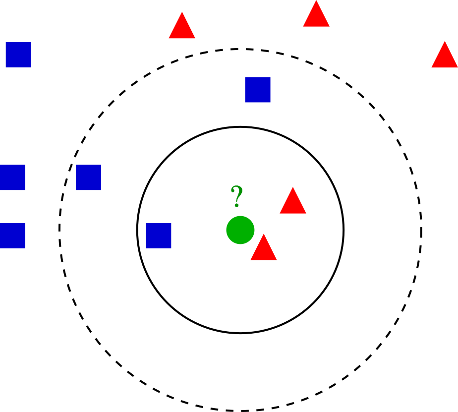
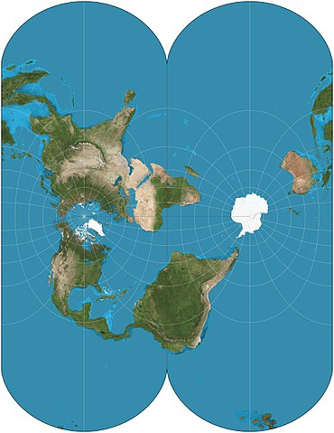
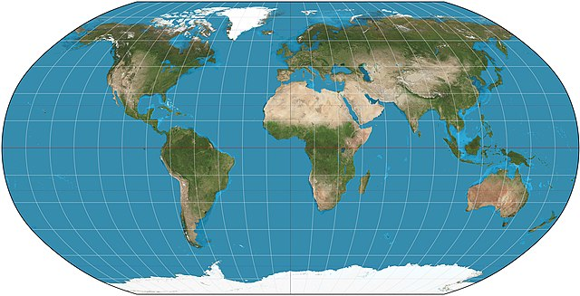
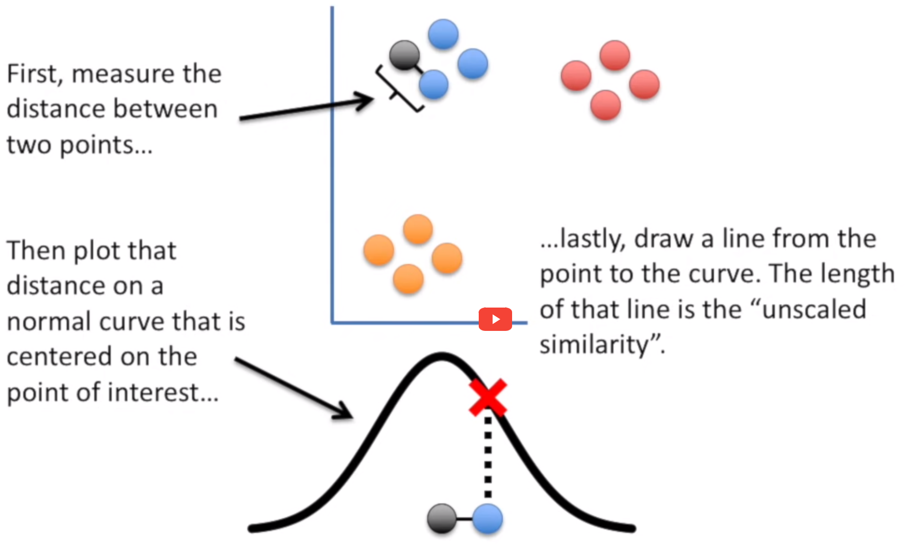
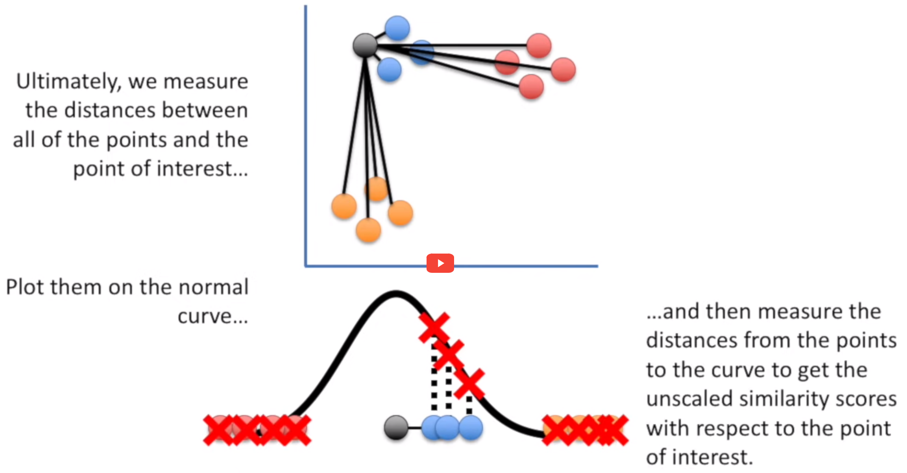

# Setup

<link rel="stylesheet" href="headers.css">

```{r setup}
# .libPaths(new = "/scratch/local/rseurat/pkg-lib-4.2.3")

suppressMessages({
  library(tidyverse)
  library(Seurat)
})


set.seed(8211673)

knitr::opts_chunk$set(echo = TRUE, format = TRUE, out.width = "100%")


options(
  parallelly.fork.enable = FALSE,
  future.globals.maxSize = 8 * 1024^2 * 1000
)

plan("multicore", workers = 8)
```

```{r useful-information, echo=FALSE}
cat("work directory: ", getwd())
cat("\n")
cat("library path(s): ", .libPaths())
```

# Load Data

We'll be working with the data from "First steps", let's quickly re-load and re-process again:

```{r initial, warning=FALSE}
pbmc <- Read10X(data.dir = "./datasets/filtered_gene_bc_matrices/hg19/") %>%
  CreateSeuratObject(counts = ., project = "pbmc3k", min.cells = 3, min.features = 200)

pbmc[["percent.mt"]] <- PercentageFeatureSet(pbmc, pattern = "^MT-")

pbmc <- subset(pbmc, subset = nFeature_RNA > 200 & nFeature_RNA < 2500 & percent.mt < 5)

pbmc <- NormalizeData(pbmc, verbose = FALSE)

pbmc <- FindVariableFeatures(pbmc, verbose = FALSE)

pbmc <- ScaleData(pbmc, features = rownames(pbmc), verbose = FALSE)

pbmc <- RunPCA(pbmc, features = VariableFeatures(pbmc), verbose = FALSE)
```

When working on your own, you will avoid re-running everything like we did here.
We had the privilege of working with an educational dataset that has only 2700 cells.
So these steps are not super intensive to re-compute.
On a real dataset, you would *write* it to disk with `saveRDS(SeuratObj, file = "./data.rds")`.
And afterwards, you would *load* from disk with the function `readRDS`.

**It's important that we keep track of our active identity.**

# Clustering

The next step follow the work pioneered by `PhenoGraph`, a robust computational method that partitions high-dimensional single-cell data into subpopulations.
Building on these subpopulations, `PhenoGraph` authors developed additional methods to extract high-dimensional signaling phenotypes and infer differences in functional potential between subpopulations.
<!-- For details, be sure to check the [research paper](http://www.ncbi.nlm.nih.gov/pubmed/26095251) cited by seurat developers. -->

These subpopulations *could* be of biological relevance, retrieving these is our goal.
The definition of such groupings depend upon the parameters.
This algorithm in particular is the K Nearest Neighbors (KNN) graph that is constructed based on the euclidean distance in PCA space.
For an example of building such a graph, imagine we took only two PCs (principal components) and had such an arrangement of cells like these dots in a 2D plane...

```{r, echo=FALSE}

```

On our example of k-NN classification for a cell highlighted in green color, the test sample (green dot) should be classified either to the group made of blue squares or to the subpopulation of cells here represented in red triangles.
If k = 3 (solid line circle) it is assigned to the red triangles because there are 2 triangles and only 1 square inside the inner circle.
If k = 5 (dashed line circle) it is assigned to the blue squares (3 squares vs. 2 triangles inside the outer circle).

There's a drawback with the 'majority voting' scheme, the assignment of such clusters is biased towards the clusters that have greater number of members (especially when ties start appearing).
For that reason, we'll refine the process by using a graph, where edge weights between any two cells is based on the shared overlap in their local neighborhoods (Jaccard similarity).

$$
J(A,B) = \frac{Intersect(A,B)}{Union(A,B)} = J(B,A)
$$

**If two datasets share the exact same members, their Jaccard Similarity Index will be 1. Conversely, if they have no members in common then their similarity will be 0.**

All the process described before, including the use of Jaccard Similarity Index is performed using the `FindNeighbors()` function, and takes as input the previously defined dimensionality of the dataset (first 10 PCs).
So the KNN is build using multidimensional space, but the rules we just saw for 2D still apply.


```{r findneighbours}
pbmc <- FindNeighbors(pbmc, dims = seq_len(10))
```

We want to keep our clusters looking natural.
That is, we want to have a modularity optimization on top of all.
For that, we'll use the community search algorithm for graphs called Louvain.
You can read more about it and it's improved version ("Leiden") [here](https://www.nature.com/articles/s41598-019-41695-z).

The `FindClusters()` function implements this procedure, and contains a `resolution` parameter that sets the 'granularity' of the downstream clustering, with increased values leading to a greater number of clusters.
Usually, setting this parameter between `0.4` and `1.2` returns good results for single-cell datasets of around 3K cells.
You can easily try various values and see how it performs.
Optimal resolution often increases for larger datasets.

```{r findclusters}
pbmc <- FindClusters(pbmc, resolution = 0.5)
```

After this process, we have a new `seurat_clusters` column in our `meta.data` layer (slot).
Also, this is our new active identity!

```{r ident_clu}
head(Idents(pbmc))
```


<!-- NOTE: The [upcoming v5](https://doi.org/10.1101/2022.02.24.481684) of Seurat will include a new clustering method [(specifically designed for handling data sets with the number of cells in the order of millions.)](https://satijalab.org/seurat/articles/seurat5_sketch_analysis.html) -->

# Plot PC values per cluster

Per-cluster values can be plotted e.g. as violin plots with the Seurat function VlnPlot():

```{r PC_per_cluster, echo=FALSE}

VlnPlot(pbmc,features=paste("PC",1:5,sep="_"),group.by="seurat_clusters")
```

# Embeddings in 2D space

## PCA: Principal Component Analysis

One key feature of PCA is that it amounts to a **linear** data transformation which preserves distances between all samples (here: cells) by simple rotation in a high dimensional space.
This is useful to identify informative directions and reduce noise (before clustering).
The projection on the first two components is often visualized because those correspond to the directions of maximal variation in the data.
And as we might expect, the different clusters can be seen as --more or less-- separating in this projection:

```{r clusters_by_pca, echo=FALSE}
DimPlot(pbmc, reduction = "pca")

```

There are other **non-linear** projection techniques that aim specifically to preserve distances between samples in 2 dimensions.
In general this is impossible, but one can at least hope to preserve **local** distances: nearby cells in high dimension will be nearby in 2D.

Consider a simple geographic map, it shares the same goal.
Given its limits, it requires some choices: a sphere cannot be mapped uniquely into 2D.
That is why we have different projections, depicted here are two different works, just as an example.
<!-- https://en.wikipedia.org/wiki/List_of_map_projections -->

```{r cartography, echo=FALSE, out.width="49%", out.height="49%", fig.show='hold', fig.align="center"}


```

For single-cell studies, two (similar) methodologies are popular: t-SNE and UMAP.
The second one was developed 10 years later, and it adds a bunch of advantages.

## t-SNE: t-distributed stochastic neighbor embedding

```{r sq_tsne, echo=FALSE, out.width="49%", out.height="49%", fig.show='hold', fig.align="center"}


```

Here the key idea is to first map distances between cells/ samples, $i$ and $j$, to probabilities

-   in high dimensions: $d_{ij} \to p_{ij}$,
-   in low dimensions (2D): $\delta_{ij} \to q_{ij}$

Cells are then iteratively moved around in 2D until $q_{ij} \approx p_{ij}$.

The t- in t-SNE just corresponds to a specific choice of the map $\delta_{ij} \to q_{ij}$ which has proved useful for a wide range of applications.
For further details, see some of these resources:

-   [Google TechTalk](https://www.youtube.com/watch?v=RJVL80Gg3lA&list=UUtXKDgv1AVoG88PLl8nGXmw) (Duration 55 min.)
-   [StatQuest!](https://www.youtube.com/watch?v=NEaUSP4YerM) video (Duration 10 min.) The screenshots included above come from here.
-   [Article at Distill](https://distill.pub/2016/misread-tsne/) on the effects of parameters.
-   [2019 paper](https://www.nature.com/articles/s41467-019-13056-x) summarizing the challenges of t-SNE for scRNA-seq data.
-   [original paper](https://jmlr.csail.mit.edu/papers/volume9/vandermaaten08a/vandermaaten08a.pdf) from 2008.

The technical details may be challenging, but the execution in Seurat is straightforward.
Keep in mind that this algorithm has many parameters that can be adjusted, one of the most relevant is  **perplexity** (see `?Rtsne::Rtsne` for further details.) This value is our way of telling to the algorithm (loosely) how to balance attention between local and global aspects of your data.
The parameter is, in a sense, a guess about the number of close neighbors each point has.

```{r tsne}
pbmc <- RunTSNE(pbmc)
DimPlot(pbmc, reduction = "tsne")
```


> According to the docs, perplexity should always follow: `3 * perplexity < nrow(X) -1`.


```{r tsne_stochastic, eval=FALSE}
p1 <- pbmc %>%
  RunTSNE(seed.use = NULL) %>%
  DimPlot(reduction = "tsne")
p2 <- pbmc %>%
  RunTSNE(seed.use = NULL) %>%
  DimPlot(reduction = "tsne")
p1 + p2
```

> **Conclusion:** t-SNE is a stochastic algorithm.
> It starts with a random projection, and then accommodates the points in the lower dimension by moving them iteratively, guided by the similarity scores (the Student distribution.)

## UMAP: Uniform Manifold Approximation and Projection

t-SNE and UMAP have the same principle and workflow: create a high dimensional graph, then reconstruct it in a lower dimensional space while retaining the structure.

One of the differences between UMAP and t-SNE is that instead of using the Normal Probability Density Function (Gaussian bell depicted in the pictures above), we'll be using an asymmetric function: the base-2 logarithm of a given integer.
This integer is one of our biggest parameter to explore: number of neighbors.

```{r sq_umap, echo=FALSE, fig.align="center"}
knitr::include_graphics("images/umap.png")
```

For further details, see some of these resources:

-   [McInnes et al. 2018](https://arxiv.org/pdf/1802.03426)
-   [Google PAIR](https://pair-code.github.io/understanding-umap/) from Google's People+AI Research (PAIR) initiative.
-   [StatQuest video](https://www.youtube.com/watch?v=eN0wFzBA4Sc), the screenshot above comes from this one.
-   [Parameter Tuning Tutorial](https://umap-learn.readthedocs.io/en/latest/parameters.html) on the official Python Implementation (McInnes et al.)

One of the key differences with t-SNE, is that instead of starting from a completely random projection, UMAP starts with an 'Spectral Embedding'.
That's a whole another Manifold learning algorithm, but what's important is that this is going to be a better approximation than just using a random setting.

UMAP has a similar goal as t-SNE; but it also tries to preserve more global aspects of the data structure.
It has several advantages:

-   faster approximation
-   less sensitive to seed
-   **better balance between local and global structure**

Thanks to Seurat, and the underlying package (see `?uwot::umap`), finding and plotting the UMAP projection is also straightforward:

```{r umap, warning=FALSE}
pbmc <- RunUMAP(pbmc, dims = 1:5, verbose = FALSE)
DimPlot(pbmc, reduction = "umap")
```

Unsurprisingly there are again many parameters that can change the visualization.


### Take Away

```{r}
DimPlot(pbmc, reduction = "umap") + NoLegend() |
  DimPlot(pbmc, reduction = "tsne") + NoLegend()
```

-   Global distances and orientations should not be over-interpreted.
-   We're distorting the data to fit it into lower dimensions. Both algorithms aim to facilitate **visualization**, there is no ground truth.
-   Parameter exploration is allowed, and **very much encouraged**.


# End
