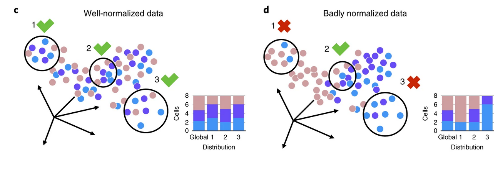
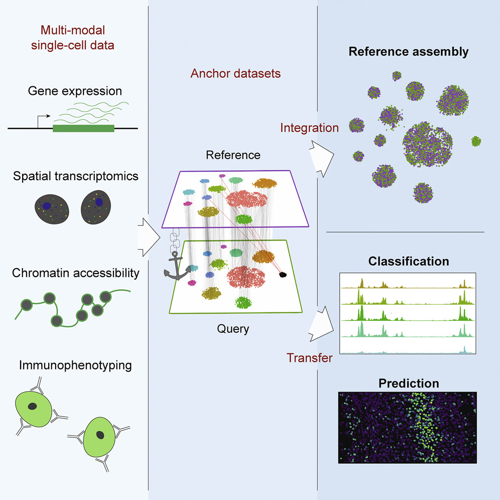

## Outline

- Setup
- Sources of batch effects
- Dataset
- Detecting batch effects
- Mitigating batch effects
- SessionInfo

## Setup

```{r, setup, include=FALSE}
# .libPaths("/rstudio/sikora/rstudio/R/workbench-library/4.1")
library(formatR)
library(knitr)
library(kableExtra)
library(magrittr)
# knitr::opts_knit$set(root.dir = '/data/manke/processing/sikora/Rseurat_wdir')
knitr::opts_chunk$set(fig.width=6, fig.height=5,message=FALSE,warning=FALSE,tidy=TRUE, tidy.opts=list(width.cutoff=40)) 
```

```{r seuratVersion,warning=FALSE,message=FALSE}
library(Seurat)
packageVersion("Seurat")

```
## Sources of batch effects

- Cell/RNA isolation (e.g. FACS)
- Library construction
- Sequencing run
- Sequencing technology
- Individual (patient sample)
- The person performing the experiment


## SeuratData

Pancreatic cells sequenced with 4 different single cell technologies, with various numbers of replicates.

```{r SeuratData}
#devtools::install_github('satijalab/seurat-data')
library(SeuratData)
#AvailableData()
InstallData("panc8")
panc <- LoadData("panc8", type = "default")
kable(table(panc$dataset)) %>% kable_classic_2(full_width = F)
```

## What does the data look like out of the box?

Lets process the dataset in a standard way, ignoring any possible batch effects.

```{r process_noBER}
panc <- NormalizeData(panc)
panc <- FindVariableFeatures(panc, selection.method = "vst", nfeatures = 2000)
all.genes <- rownames(panc)
panc <- ScaleData(panc, features = all.genes)
panc <- RunPCA(panc, features = VariableFeatures(object = panc))
panc <- RunUMAP(panc, dims = 1:15)
```

## What does the data look like out of the box?

```{r out_of_the_box_umap, echo = FALSE,fig.width=12,fig.show='hold',fig.align='center',fig.cap=c("By technology.","By cell type.")}
p1<-DimPlot(panc, reduction = "umap",label=TRUE)
p2<-DimPlot(panc, reduction = "umap",group.by="celltype")
p1+p2
```

## Subset dataset 

```{r subset}
panc_sub <- subset(x=panc,subset = dataset == c("celseq","celseq2","smartseq2"))
kable(table(panc_sub$dataset)) %>%  kable_classic_2(full_width = F)
```

## Redo normalization

```{r norm_sub}
panc_sub <- NormalizeData(panc_sub)
panc_sub <- FindVariableFeatures(panc_sub, selection.method = "vst", nfeatures = 2000)
all.genes <- rownames(panc_sub)
panc_sub <- ScaleData(panc_sub, features = all.genes)
panc_sub <- RunPCA(panc_sub, features = VariableFeatures(object = panc_sub))
panc_sub <- RunUMAP(panc_sub, dims = 1:15)
```

## Revisit UMAP

```{r umap_sub, echo=FALSE,fig.width=12,fig.show='hold',fig.align='center',fig.cap=c("By technology.","By cell type.")}
p1<-DimPlot(panc_sub, reduction = "umap",label=TRUE)
p2<-DimPlot(panc_sub, reduction = "umap",group.by="celltype")
p1+p2
```

## How do we measure batch effects?

We can see various amounts of batch effect by eye. Let's try to calculate some metrics using the kBET package from Theis lab.

{width=80%,height=80%}


## Run kBET

```{r kBET1}
devtools::install_github('theislab/kBET')
library(kBET)
library(ggplot2)

d<-t(as.matrix(GetAssayData(panc_sub,slot="data",assay="RNA")))
b<-as.vector(t(panc_sub[["dataset"]]))
batch.estimate <- kBET(df=d, batch=b, plot=FALSE)
plot.data <- data.frame(class=rep(c('observed', 'expected'), 
                                  each=length(batch.estimate$stats$kBET.observed)), 
                        data =  c(batch.estimate$stats$kBET.observed,
                                  batch.estimate$stats$kBET.expected))
```

## Plot the rejection rate

```{r kBET1_plot,fig.width=4, fig.height=3}
g <- ggplot(plot.data, aes(class, data)) + geom_boxplot() + 
  labs(x='Test', y='Rejection rate',title='kBET test results') +
  theme_bw() +  
  scale_y_continuous(limits=c(0,1))

g
```

## Is the measured batch effect significant?

```{r kBET2}
batch.estimate$summary
batch.estimate$average.pval
```

## Which PC is the major source of batch effect?

```{r kBET3}
pca.data <- prcomp(d, center=TRUE) 
batch.pca <- pcRegression(pca.data, b)
z<-batch.pca["r2"]
z$r2[which.max(z$r2[,"R.squared"]),]

```


## Inspect the result

```{r kBET3_head}

head(z$r2)
which.max(z$r2[,"R.squared"])
```

## Inspect the result

```{r kBET3_plot}
FeaturePlot(panc,features="PC_1")

```

## What options are there to mitigate batch effects ?

- Seurat Integration
- Seurat SCTransform
- Conos
- Harmony
- ComBat/SVA
- ...

## Seurat Integration: theory

{width=70%,height=70%}

## Seurat Integration: theory

Here, we develop a strategy to “anchor” diverse datasets together, enabling us to integrate single-cell measurements not only across scRNA-seq technologies, but also across different modalities. Through the identification of cell pairwise correspondences between single cells across datasets, termed “anchors,” we can transform datasets into a shared space, even in the presence of extensive technical and/or biological differences.   

## Seurat Integration: theory

We first jointly reduce the dimensionality of both datasets using diagonalized CCA, then apply L2-normalization to the canonical correlation vectors. We next search for MNNs in this shared low-dimensional representation. We refer to the resulting cell pairs as anchors, as they encode the cellular relationships across datasets that will form the basis for all subsequent integration analyses . Our anchors can successfully recover matching cell states even in the presence of significant dataset differences, as CCA can effectively identify shared biological markers and conserved gene correlation patterns.

## Seurat Integration: theory

Obtaining an accurate set of anchors is paramount to successful integration. Aberrant anchors that form between different biological cell states across datasets are analogous to noisy edges that occur in k-nearest neighbor (KNN) graphs and can confound downstream analyses. This has motivated the use of shared nearest neighbor (SNN) graphs, where the similarity between two cells is assessed by the overlap in their local neighborhoods.    

As this measure effectively pools neighbor information across many cells, the result is robust to aberrant connections in the neighbor graph.   

## Seurat Integration: theory

We introduced an analogous procedure for the scoring of anchors, where each anchor pair was assigned a score based on the shared overlap of mutual neighborhoods for the two cells in a pair. High-scoring correspondences therefore represent cases where many similar cells in one dataset are predicted to correspond to the same group of similar cells in a second dataset, reflecting increased robustness in the association between the anchor cells.    

While we initially identify anchors in low-dimensional space, we also filter out anchors whose correspondence is not supported based on the original untransformed data. The identification, filtering, and scoring of anchors is the first step for all integration analyses in this manuscript, including reference assembly, classification, and transfer learning.   

## Seurat Integration: prep datasets

```{r seurat_integrate1}
# split the dataset into a list of seurat objects 
panc.list <- SplitObject(panc_sub, split.by = "dataset")

# normalize and identify variable features for each dataset independently
panc.list <- lapply(X = panc.list, FUN = function(x) {
    x <- NormalizeData(x)
    x <- FindVariableFeatures(x, selection.method = "vst", nfeatures = 2000)
})
```

## Seurat Integration

```{r seurat_integrate2}
# select features that are repeatedly variable across datasets for integration
features <- SelectIntegrationFeatures(object.list = panc.list)

anchors <- FindIntegrationAnchors(object.list = panc.list, anchor.features = features)

# this command creates an 'integrated' data assay
panc.combined <- IntegrateData(anchorset = anchors)

```

## Process the newly integrated dataset

```{r process_integrated}
# specify that we will perform downstream analysis on the corrected data note that the
# original unmodified data still resides in the 'RNA' assay
DefaultAssay(panc.combined) <- "integrated"

# Run the standard workflow for visualization and clustering
panc.combined <- ScaleData(panc.combined, verbose = FALSE)
panc.combined <- RunPCA(panc.combined, npcs = 30, verbose = FALSE)
panc.combined <- RunUMAP(panc.combined, reduction = "pca", dims = 1:30)

```

## What does the data look like after the integration?

```{r integrated_umap, echo=FALSE,fig.width=12,fig.show='hold',fig.align='center',fig.cap=c("By technology.","By cell type.")}
p1<-DimPlot(panc.combined, reduction = "umap",label=TRUE)
p2<-DimPlot(panc.combined, reduction = "umap",group.by="celltype")
p1+p2
```

## What does the batch effect look like after the integration?

We can see that the cells from different datasets overlap, and there appears to be one major cluster per cell type. Let's try to calculate some metrics using the kBET package from Theis lab.

```{r integrated_kBET1}
d<-t(as.matrix(GetAssayData(panc.combined,slot="scale.data",assay="integrated")))
b<-as.vector(t(panc.combined[["dataset"]]))
batch.estimate <- kBET(df=d, batch=b, plot=FALSE)

plot.data <- data.frame(class=rep(c('observed', 'expected'), 
                                  each=length(batch.estimate$stats$kBET.observed)), 
                        data =  c(batch.estimate$stats$kBET.observed,
                                  batch.estimate$stats$kBET.expected))
```


## Inspect the result

```{r integrated_kBET1_plot,fig.width=4, fig.height=3}
  g <- ggplot(plot.data, aes(class, data)) + geom_boxplot() + 
  labs(x='Test', y='Rejection rate',title='kBET test results') +
  theme_bw() +  
  scale_y_continuous(limits=c(0,1))

g
```

## Is the measured batch effect significant?

```{r integrated_kBET2}
batch.estimate$summary
batch.estimate$average.pval
```

## Which PC is the major source of batch effect?

```{r integrated_kBET3}
pca.data <- prcomp(d, center=TRUE) 
batch.pca <- pcRegression(pca.data, b)
z<-batch.pca["r2"]
z$r2[which.max(z$r2[,"R.squared"]),]
```

## Inspect the result

```{r integrated_kBET3_inspect}
head(z$r2)
which.max(z$r2[,"R.squared"])
```

## Outlook

- Verify that expected marker genes are expressed per cell population

## SessionInfo

```{r sessionInfo}
sessionInfo()
```

## Citations

Büttner, M., Miao, Z., Wolf, F.A. et al. A test metric for assessing single-cell RNA-seq batch correction. Nat Methods 16, 43–49 (2019). https://doi.org/10.1038/s41592-018-0254-1  

Stuart T, Butler A, Hoffman P, Hafemeister C, Papalexi E, Mauck WM 3rd, Hao Y, Stoeckius M, Smibert P, Satija R. Comprehensive Integration of Single-Cell Data. Cell. 2019 Jun 13;177(7):1888-1902.e21. doi: 10.1016/j.cell.2019.05.031. Epub 2019 Jun 6. PMID: 31178118; PMCID: PMC6687398

