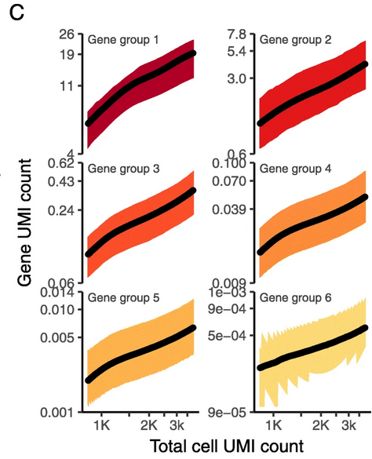
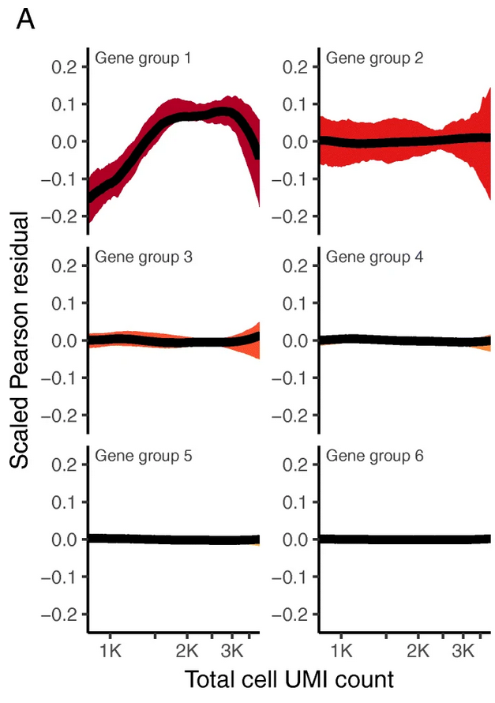
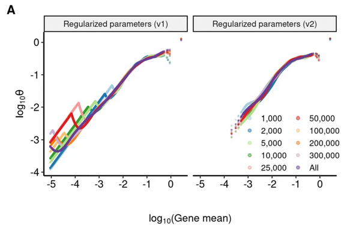

## Outline

- Setup
- Dataset
- Standard normalization
- SCTransform
- Seurat Integrate
- DGE
- SessionInfo

## Setup

```{r, setup, include=FALSE}
# .libPaths("/rstudio/sikora/rstudio/R/workbench-library/4.1")
library(formatR)
library(knitr)
library(kableExtra)
library(magrittr)
knitr::opts_chunk$set(fig.width=6, fig.height=4,message=FALSE,warning=FALSE,tidy=TRUE, tidy.opts=list(width.cutoff=70)) 
```

```{r seuratVersion,warning=FALSE,message=FALSE}
library(ggplot2)
library(Seurat)
packageVersion("Seurat")

```
## SCTransform: theory

- Default log-normalization:
  - @counts: read count matrix e.g. from STARsolo ("raw counts")
  - @data: log1p(counts/sum(counts)*scale_factor)
  - @scale.data: scale(data, scale=TRUE, center=TRUE)
  
- SCTransform
  - @scale.data: Pearson residuals from glm(raw_counts~log_umi_per_cell; error_model="NB") --> details 
  - @counts: "corrected" counts back-calculated from @scale.data --> details
  - @data: log1p(counts)
  

## SCTransform: @scale.data

$equation \begin{array}{*{20}l} x_{gc} &\sim \text{NB}(\mu_{gc}, \theta_{g})\\ \ln \mu_{gc} &= \beta_{g0} + \ln n_{c}, \end{array} $

where θ_g is the gene-specific dispersion parameter, $n_{c}=\sum _{g} x_{gc}$ is the total sequencing depth and the variance of the negative binomial (NB) is given by $ \mu _{gc} + \mu _{gc}^{2}/\theta _{g} $

For each gene-cell combination, the Pearson residuals Z_gc are given by:
$ \begin{array}{*{20}l} Z_{gc} &= \frac{x_{gc}-\mu_{gc}}{\sigma_{gc}}\\ \mu_{gc} &= \exp{\beta_{g0} + \ln{n_{c}}} \\ \sigma_{gc} &= \sqrt{\mu_{gc} + \frac{\mu_{gc}^{2}}{\theta_{gc}}}, \end{array} $

## SCTransform: @counts
$ \begin{array}{*{20}l} \mu_{gc} &= \exp{\beta_{g0} + \ln{n_{0}}}, \\ \sigma_{gc} &= \sqrt{\mu_{gc} + \frac{\mu_{gc}^{2}}{\theta_{gc}}},\\ y_{gc} &= \text{floor}(Z_{gc} \sigma_{gc} + \mu_{gc}), \end{array} $

## SCTransform: gene counts ~ cell counts



## SCTransform: theta regularization


  

## SCTransform: long story short

- Requires UMIs
- Removes the effect of sequencing depth through regression
- Optional: regress other confounding variables out (e.g. perct. MT)


## SeuratData

IFNB-Stimulated and Control human ctrls.


```{r SeuratData}
library(SeuratData)
ifnb <- LoadData("ifnb")
ifnb_sub<-subset(x = ifnb, downsample = 1000)
table(ifnb_sub$stim)
ifnb.list <- SplitObject(ifnb_sub, split.by = "stim")

ctrl <- ifnb.list[["CTRL"]]
stim <- ifnb.list[["STIM"]]
```

## Standard normalization?

Lets process the dataset in a standard way.

```{r process_noBER}
ctrl <- NormalizeData(ctrl)
ctrl <- FindVariableFeatures(ctrl, selection.method = "vst", nfeatures = 2000)
all.genes <- rownames(ctrl)
ctrl <- ScaleData(ctrl, features = all.genes)
ctrl <- RunPCA(ctrl, features = VariableFeatures(object = ctrl))
ctrl <- RunUMAP(ctrl, dims = 1:15)
```

## What does the data look like out of the box?

```{r out_of_the_box_umap, echo = FALSE, fig.show='hold',fig.align='center',fig.width=8,fig.height=5}
p1<-DimPlot(ctrl, reduction = "umap",group.by="seurat_annotations",label=TRUE) + theme(legend.position = "bottom")
p2<-FeaturePlot(ctrl,"nCount_RNA") + theme(legend.position = "top")
p1+p2

```


## Seurat SCTransform

```{r seurat_sctransform1}
library(sctransform)
library(glmGamPoi)
ctrl <- SCTransform(ctrl, method = "glmGamPoi",vst.flavor = "v2", verbose = FALSE)
# store mitochondrial percentage in object meta data
#ctrl <- PercentageFeatureSet(ctrl, pattern = "^MT-", col.name = "percent.mt")
#ctrl <- SCTransform(ctrl, method = "glmGamPoi", vars.to.regress = "percent.mt", verbose = FALSE)
```


## Recalculate Dimensional Reductions

```{r sct_umap_calc}
DefaultAssay(ctrl)<-"SCT"
ctrl <- RunPCA(ctrl, verbose = FALSE)
ctrl <- RunUMAP(ctrl, dims = 1:30, verbose = FALSE)

```


## Revisit UMAP

```{r sct_umap_plot, echo = FALSE, fig.show='hold',fig.align='center',fig.width=8,fig.height=5}

p1<-DimPlot(ctrl, reduction = "umap",group.by="seurat_annotations",label=TRUE) + theme(legend.position = "bottom")
p2<-FeaturePlot(ctrl,"nCount_RNA") + theme(legend.position = "top")
p1+p2

```

## Assignment

Apply SCTransform to the IfnB-stimulated dataset as well. How does the lowD representation change using SCT versus log-Norm ?

## Prepare both datasets for integration

```{r sct_stim}
stim <- SCTransform(stim, method="glmGamPoi",vst.flavor = "v2", verbose = FALSE) %>%
    RunPCA(npcs = 30, verbose = FALSE)
ifnb.list <- list(ctrl = ctrl, stim = stim)
features <- SelectIntegrationFeatures(object.list = ifnb.list, nfeatures = 3000)
ifnb.list <- PrepSCTIntegration(object.list = ifnb.list, anchor.features = features)

```


## Seurat Integrate

```{r seurat_integrate1}
immune.anchors <- FindIntegrationAnchors(object.list = ifnb.list, normalization.method = "SCT",
    anchor.features = features)
immune.combined.sct <- IntegrateData(anchorset = immune.anchors, normalization.method = "SCT")

```

## Process the newly integrated dataset

```{r process_integrated}
immune.combined.sct <- RunPCA(immune.combined.sct, verbose = FALSE)
immune.combined.sct <- RunUMAP(immune.combined.sct, reduction = "pca", dims = 1:30, verbose = FALSE)
```

## What does the data look like after the integration?

```{r integrated_umap, echo=FALSE,fig.show='hold',fig.align='center',fig.width=8,fig.height=5}
DimPlot(immune.combined.sct, reduction = "umap", split.by = "stim",group.by="seurat_annotations") + theme(legend.position = "bottom")
```

## DE genes

Get a list of top 10 DE genes between stimulated and unstimulated B cells.

```{r sct_de}
immune.combined.sct$celltype.stim <- paste(immune.combined.sct$seurat_annotations, immune.combined.sct$stim,
    sep = "_")
Idents(immune.combined.sct) <- "celltype.stim"
immune.combined.sct <- PrepSCTFindMarkers(immune.combined.sct)

b.interferon.response <- FindMarkers(immune.combined.sct, assay = "SCT", ident.1 = "B_STIM", ident.2 = "B_CTRL",
    verbose = FALSE)
head(b.interferon.response, n = 10)
```

## Assignment

Plot SCT "corrected counts" for one of the DE genes on a lowD representation, splitting by the stimulation status.

## Proposed solution

```{r DE_plot,fig.height=4, fig.width=8}
Idents(immune.combined.sct) <- "seurat_annotations"
DefaultAssay(immune.combined.sct) <- "SCT"
FeaturePlot(immune.combined.sct, features = rownames(b.interferon.response)[1], split.by = "stim", max.cutoff = 3,
    cols = c("grey", "red"))

```

## SessionInfo

```{r sessionInfo}
sessionInfo()
```

## Citations

Hafemeister, C., Satija, R. Normalization and variance stabilization of single-cell RNA-seq data using regularized negative binomial regression. Genome Biol 20, 296 (2019). https://doi.org/10.1186/s13059-019-1874-1

Choudhary, S., Satija, R. Comparison and evaluation of statistical error models for scRNA-seq. Genome Biol 23, 27 (2022). https://doi.org/10.1186/s13059-021-02584-9

Ahlmann-Eltze C, Huber W (2020). “glmGamPoi: Fitting Gamma-Poisson Generalized Linear Models on Single Cell Count Data.” Bioinformatics. doi: 10.1093/bioinformatics/btaa1009, https://doi.org/10.1093/bioinformatics/btaa1009. 

