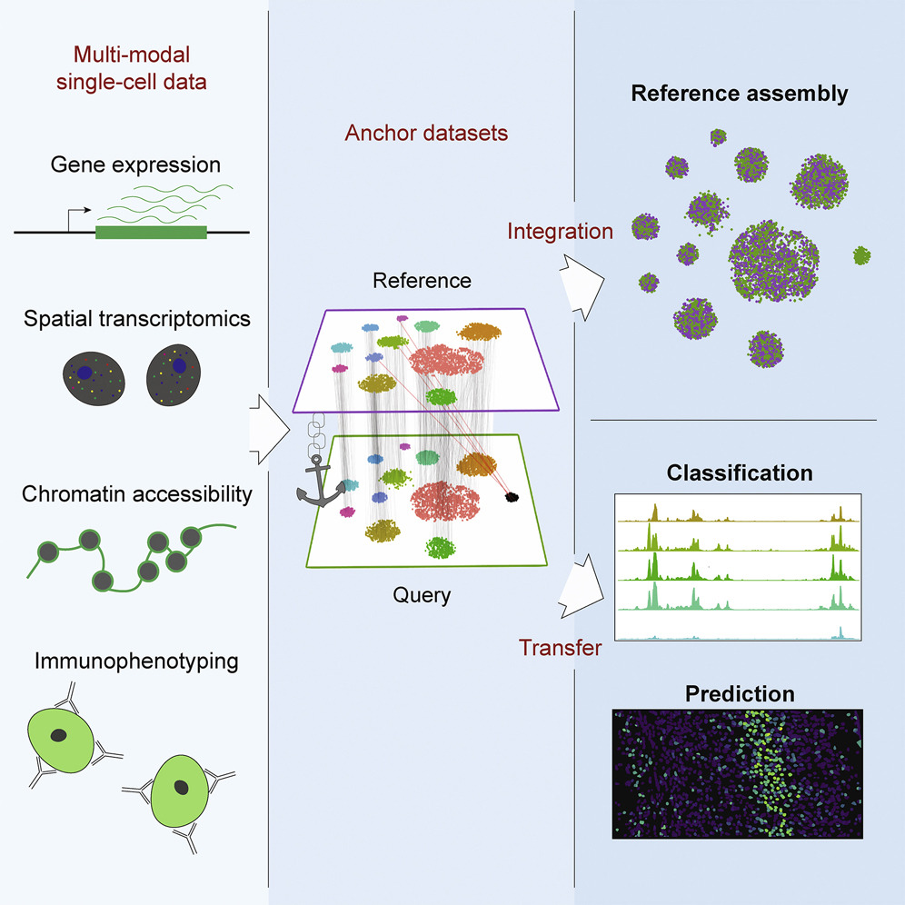

## Outline

- Setup
- Dataset
- SingleR
- Seurat Integration and Label Transfer
- Differences summary
- Other options
- SessionInfo

## Goal

You have a 'query' pbmc dataset and you would like to annotate the cell types using a published reference dataset. We will attempt an automated annotation relying on the similarity of cells in query and reference datasets.

## Setup

```{r, setup, include=FALSE}
# .libPaths("/rstudio/sikora/rstudio/R/workbench-library/4.1")
library(formatR)
library(knitr)
library(kableExtra)
library(magrittr)
knitr::opts_chunk$set(fig.width=6, fig.height=4,message=FALSE,warning=FALSE,tidy=TRUE, tidy.opts=list(width.cutoff=70)) 
```

```{r loadLibs,warning=FALSE,message=FALSE}
library(SingleCellExperiment)
library(Seurat)
library(SingleR)
library(scater)
library(scran)
```


## Preprocess reference dataset.


```{r ref_data}
#pbmc_ref<-readRDS("pbmc_sorted_norm.rds")
#pbmc_ref_meta<-readRDS("pbmc_sorted_meta.rds")
#pbmc_ref_sce<-SingleCellExperiment(list(counts=pbmc_ref),colData=DataFrame(label=pbmc_ref_meta$id_extract))
#pbmc_ref_sce<-logNormCounts(pbmc_ref_sce)
#saveRDS(pbmc_ref_sce,"pbmc_ref_sce.RDS")

#download preprocessed file
#if (!file.exists("datasets/preprocessed_rds/pbmc_ref_sce.RDS")){
#utils::download.file("https://zenodo.org/record/7845337/files/pbmc_ref_sce.RDS?download=1",destfile="datasets/preprocessed_rds/pbmc_ref_sce.RDS",method="wget")}
#pbmc_ref_sce<-readRDS("datasets/preprocessed_rds/pbmc_ref_sce.RDS")
```

## Load query dataset.

```{r seurat_to_sce}
library(SeuratData)
data("pbmc3k")
pbmc<-pbmc3k.final
sce <- as.SingleCellExperiment(DietSeurat(pbmc))
```
## SingleR : theory

{width=80%,height=80%}


## SingleR : theory

The SingleR() function identifies marker genes from the reference and uses them to compute assignment scores (based on the Spearman correlation across markers) for each cell in the test dataset against each label in the reference. The label with the highest score is the assigned to the test cell, possibly with further fine-tuning to resolve closely related labels. 

## SingleR : theory

For use with scRNAseq reference, set de.method to wilcox or t. This marker detection mode considers the variance of expression across cells. Here, we will use the Wilcoxon ranked sum test to identify the top markers for each pairwise comparison between labels. This is slower but more appropriate for single-cell data compared to the default marker detection algorithm (which may fail for low-coverage data where the median is frequently zero).


## Run SingleR to predict cell labels


```{r process_ref_sce}
#set seed for the aggregation to be reproducible
#set.seed(123)
#ref.labels <- SingleR(test = sce,assay.type.test = "logcounts",ref = pbmc_ref_sce,labels = pbmc_ref_sce$label,aggr.ref=TRUE,de.method="wilcox")
#saveRDS(ref.labels,"ref.labels.RDS")

#download labels:
#if (!file.exists("datasets/preprocessed_rds/ref.labels.RDS")){
#utils::download.file("https://zenodo.org/record/7845337/files/ref.labels.RDS?download=1",destfile="datasets/preprocessed_rds/ref.labels.RDS",method="wget")}
ref.labels<-readRDS("datasets/preprocessed_rds/ref.labels.RDS")
```

## Tabulate reference labels

```{r print_table_ref}
kable(table(ref.labels$pruned.labels)) %>% kable_paper("hover", full_width = F)
```

## Annotate query and filter identities

```{r filter_Idents}
pbmc@meta.data$SingleR_labels <- ref.labels$pruned.labels
pbmc@meta.data$SingleR_score <- apply(ref.labels$scores,1,function(X)X[which.max(X)])
pbmc[["SingleR_labels"]][pbmc[["SingleR_score"]]<0.5]<-NA
```

## Tabulate SingleR and reference identities

```{r tab_idents_SingleR}
kable(table(pbmc[["seurat_annotations"]]$seurat_annotations,pbmc[["SingleR_labels"]]$SingleR_labels)) %>% kable_classic_2(full_width = F)
```

## Prepare label plots

```{r prep_plot_SingleR}
p1<-DimPlot(pbmc, label = T , repel = T, label.size = 3,group.by="SingleR_labels") + NoLegend()
p2<-DimPlot(pbmc, label = T , repel = T, label.size = 3,group.by="seurat_annotations") + NoLegend()
```

## Review the plots

```{r plot_SingleR,fig.height=5,fig.width=8}
p1+p2
```

## Seurat Integration: theory

{width=70%,height=70%}


## Seurat Integration: theory

Here, we develop a strategy to “anchor” diverse datasets together, enabling us to integrate single-cell measurements not only across scRNA-seq technologies, but also across different modalities. Through the identification of cell pairwise correspondences between single cells across datasets, termed “anchors,” we can transform datasets into a shared space, even in the presence of extensive technical and/or biological differences.   

## Seurat Integration: theory

We first jointly reduce the dimensionality of both datasets using diagonalized CCA, then apply L2-normalization to the canonical correlation vectors. We next search for MNNs in this shared low-dimensional representation. We refer to the resulting cell pairs as anchors, as they encode the cellular relationships across datasets that will form the basis for all subsequent integration analyses . Our anchors can successfully recover matching cell states even in the presence of significant dataset differences, as CCA can effectively identify shared biological markers and conserved gene correlation patterns.

## Seurat Integration: theory

Obtaining an accurate set of anchors is paramount to successful integration. Aberrant anchors that form between different biological cell states across datasets are analogous to noisy edges that occur in k-nearest neighbor (KNN) graphs and can confound downstream analyses. This has motivated the use of shared nearest neighbor (SNN) graphs, where the similarity between two cells is assessed by the overlap in their local neighborhoods.    

As this measure effectively pools neighbor information across many cells, the result is robust to aberrant connections in the neighbor graph.   

## Seurat Integration: theory

We introduced an analogous procedure for the scoring of anchors, where each anchor pair was assigned a score based on the shared overlap of mutual neighborhoods for the two cells in a pair. High-scoring correspondences therefore represent cases where many similar cells in one dataset are predicted to correspond to the same group of similar cells in a second dataset, reflecting increased robustness in the association between the anchor cells.    

While we initially identify anchors in low-dimensional space, we also filter out anchors whose correspondence is not supported based on the original untransformed data. The identification, filtering, and scoring of anchors is the first step for all integration analyses in this manuscript, including reference assembly, classification, and transfer learning.

## Seurat Integration: load reference dataset

```{r process_ref_seurat}
#pbmc_ref.seurat <- as.Seurat(as(pbmc_ref_sce,"SingleCellExperiment"), counts = "counts", data = "logcounts")
#pbmc_ref.seurat <- ScaleData(pbmc_ref.seurat, verbose = FALSE)
#pbmc_ref.seurat <- RunPCA(pbmc_ref.seurat, npcs = 30, verbose = FALSE)
#pbmc_ref.seurat <- FindVariableFeatures(pbmc_ref.seurat)
#saveRDS(pbmc_ref.seurat,"pbmc_ref.seurat.RDS")

#dowload preprocessed dataset
#if (!file.exists("datasets/preprocessed_rds/pbmc_ref.seurat.RDS")){
#utils::download.file("https://zenodo.org/record/7845337/files/pbmc_ref.seurat.RDS?download=1",destfile="datasets/preprocessed_rds/pbmc_ref.seurat.RDS",method="wget")}
pbmc_ref.seurat<-readRDS("datasets/preprocessed_rds/pbmc_ref.seurat.RDS")
pbmc_ref.seurat_sub<-subset(pbmc_ref.seurat,downsample=2000)
```

## Seurat Integration: transfer labels

```{r transfer_data}
pbmc.anchors <- FindTransferAnchors(reference = pbmc_ref.seurat_sub, query = pbmc, dims = 1:30, reference.reduction = "pca")
predictions <- TransferData(anchorset = pbmc.anchors, refdata = pbmc_ref.seurat_sub$label,dims = 1:30)
pbmc <- AddMetaData(pbmc, metadata = predictions)

```

## Filter labels

```{r filter_annotations}
pbmc[["predicted.id"]][pbmc[["prediction.score.max"]]<0.5]<-NA
```

## Tabulate annotations

```{r tabulate_annotations}
kable(table(pbmc[["seurat_annotations"]]$seurat_annotations,pbmc[["predicted.id"]]$predicted.id)) %>% kable_classic_2(full_width = F)

```

## Prepare label plots

```{r prep_plot_Seurat}
p1<-DimPlot(pbmc, label = T , repel = T, label.size = 3,group.by="predicted.id") + NoLegend()
p2<-DimPlot(pbmc, label = T , repel = T, label.size = 3,group.by="seurat_annotations") + NoLegend()
```

## Review label plots

```{r plot_Seurat,fig.height=5,fig.width=8}
p1+p2
```

## A word on the observed differences

- Seurat is at its best in annotating major cell types
- SingleR outperforms Seurat at predicting rare cell types or differentiating highly similar cell types and coping with increased cell type classes

## Other options

-  Monocle3 https://cole-trapnell-lab.github.io/monocle3/
-  Numerous published tools: https://www.nature.com/articles/s41596-021-00534-0
-  Manual annotation using cell markers


## SessionInfo

```{r sessionInfo}
sessionInfo()
```

## Citations

Q. Huang, Y. Liu, Y. Du, L.X. Garmire, Evaluation of Cell Type Annotation R Packages on Single-cell RNA-seq Data, Genomics, Proteomics & Bioinformatics (2020), doi: https://doi.org/10.1016/j.gpb.2020.07.004.
G.X.Y. Zheng, J.M. Terry, P. Belgrader, P. Ryvkin, Z.W. Bent, R. Wilson, et al.
Massively parallel digital transcriptional profiling of single cells
Nat Commun, 8 (2017), p. 14049

Stuart T, Butler A, Hoffman P, Hafemeister C, Papalexi E, Mauck WM 3rd, Hao Y, Stoeckius M, Smibert P, Satija R. Comprehensive Integration of Single-Cell Data. Cell. 2019 Jun 13;177(7):1888-1902.e21. doi: 10.1016/j.cell.2019.05.031. Epub 2019 Jun 6. PMID: 31178118; PMCID: PMC6687398


