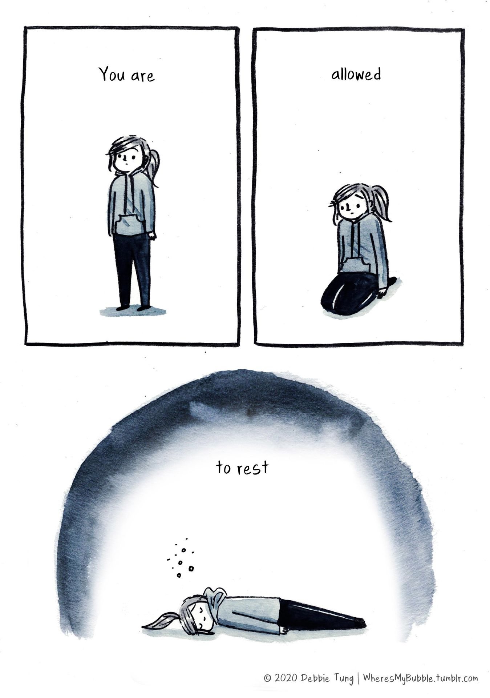

> This days is meant for **free data exploration** !

We suggest two data sets from the following publications, and their corresponding data repositories.

-   [Loo et al.](https://www.nature.com/articles/s41467-018-08079-9) - [GSE123335](https://www.ncbi.nlm.nih.gov/geo/query/acc.cgi?acc=GSE123335) E14 data **with celltype information**, and generated with [Illumina's Drop-Seq](https://www.illumina.com/science/sequencing-method-explorer/kits-and-arrays/drop-seq.html) sequencing technology.
-   [DiBella et al.](https://www.nature.com/articles/s41586-021-03670-5) - [GSM4635075](https://www.ncbi.nlm.nih.gov/geo/query/acc.cgi?acc=GSM4635075) E14 data **without celltype information**, and generated by a 10XGenomics sequencing platform.
-   DiBella celltype information can be pulled from [here](https://singlecell.broadinstitute.org/single_cell/study/SCP1290/molecular-logic-of-cellular-diversification-in-the-mammalian-cerebral-cortex).

Both analyses are centered around mouse brain development.
For details and conclusions driven from these results please consult the original research articles.

**Please make sure to run the two code blocks below!**

# Setup

<link rel="stylesheet" href="headers.css">

```{r knitr_opts}
knitr::opts_chunk$set(eval = FALSE, echo = TRUE, format = TRUE, out.width = "100%")
```

```{r hdf5r}
if (!"hdf5r" %in% installed.packages()) BiocManager::install("hdf5r")
```

```{r setup, echo=TRUE}
set.seed(8211673)

# necessary because of the read-in of the Loo et al matrix
Sys.setenv("VROOM_CONNECTION_SIZE" = 131072 * 5)

suppressMessages({
  library(tidyverse)
  library(Seurat)
  library(patchwork)
  library(pheatmap)
})

## convenient function wrapper, feel free to add your own ;)
mySCT <- function(...) {
  SCTransform(
    method = "glmGamPoi",
    vst.flavor = "v2",
    verbose = FALSE,
    ...
  )
}

options(parallelly.fork.enable = FALSE,
        future.globals.maxSize = 8 * 1024 ^ 2 * 1000)

plan("multicore", workers = 8)

cat("work directory: ", getwd())
cat("\n")
cat("library path(s): ", .libPaths())
```

# Read data

```{r ReadData, echo=TRUE}
# runs ~5min
dir <- "/scratch/local/rseurat/datasets/mouse_brain/"
mat_name <- paste0(dir, "Loo/GSE123335_E14_combined_matrix.txt.gz")
ann_name <- paste0(dir, "Loo/GSE123335_E14_combined_matrix_ClusterAnnotations.txt.gz")
loo_mat <- read.delim(mat_name, row.names = 1)
loo_meta <- read.delim(ann_name, row.names = 1) # meta.data column name = Cluster
loo <- CreateSeuratObject(counts = loo_mat, meta.data = loo_meta) # 488 MB
loo$source <- "Loo"
dim(loo)

h5_name <- paste0(dir, "DiBella/GSM4635075_E14_5_filtered_gene_bc_matrices_h5.h5")
db_mat <- Read10X_h5(filename = h5_name)
db <- CreateSeuratObject(counts = db_mat) # 222 MB
db$source <- "DiBella"
dim(db)

# clean-up
rm(loo_mat, loo_meta, db_mat)

# in case there are problems with hd5
# saveRDS(db, file='DiBella_SeuratObj.rds') #
# rds_name <- paste0(dir,"DiBella/DiBella_SeuratObj.rds")
# db <- readRDS(rds_name)
```

We made it easy here, but in the real world this may take a substantial amount of time.
Also notice that there can be various file formats in which to obtain scRNAseq datasets.

# Totally on your own ...

...just kidding.
Apart from our lecture material, you are encouraged to use general searches on the WWW (e.g. [Rseek](https://rseek.org/)).
There are excellent resources available.

Especially for Seurat, there is one outstanding cheat sheet which should help you with most of the tasks below: <https://satijalab.org/seurat/articles/essential_commands.html>

# Loo Data

The analysis of Loo *et al.* highlighted the role of `Neurod2`, `Gad2`, `Eomes`, and `Mki67.` - Prepare the data for dimensional reduction (filtering, normalization, PCA) - Check a suitable number of principal components to keep - Play around with different values of `n.neighbors` on UMAP algorithm - Plot the normalized expression of the aforementioned genes of interest

Should you be more interested in data structures, you could also check the Seurat data object with `View()` or `dplyr::glimpse()`; it's huge and has many `slots` that will be updated as the analysis proceeds.

*Notice:* Here we only use the data for E14.5 (not P0)

`loo_alone <- ...`

## Finding Clusters

Apart from yielding suggestive plots, the main reason for dimensionality reduction was `feature selection`, i.e. the selection of informative genes (and PCA components) that will enable clustering.

In fact, the authors invested much effort to identify a proper number of clusters and subclusters.

Use variable resolution parameters and inspect the results - which resolution (=number of clusters) would you choose?

**TIP**: the same `SeuratObj` may hold multiple clustering results.
By default, the column `seurat_clusters` in our `meta.data` slot will point to the last run.

<code> \# FindNeighbors(...)

# Define Resolutions, e.g. res=c(0.1, 0.25, 0.5, 0.75, 1.0)

# FindClusters(...)

# Inspect Metadata

# Plot UMAP for different resolutions (hint: change group.by= ...)

</code>

1.  Explore the different cluster solutions with respect to their sizes and pairwise relationships (hint: table).

2.  Similarly, compare a given cluster solution with the authors solution - the later is provided as metadata column 'Cluster'.

3.  **Subset** the Seurat object to visualize only specific clusters more closely un a UMAP.

*Notice:* per default the clusters are sorted by their sizes and the largest one has index 0 !

```{r explore_clusters}
# just some suggestions!

loo_alone@meta.data %>%
  select(starts_with("SCT")) %>%
  lapply(table) # cluster sizes for all resolutions

loo_alone@meta.data %>%
  select(c("Cluster", "__your_choice_here")) %>%
  table() %>%
  pheatmap() # compare cluster solution with previous annotation

loo_alone %>%
  subset(idents = "__your_choice_here") %>%
  DimPlot() # cluster selection
```

If you have more time and energy, try changing the number of PCA components and consider how this will affect the clusters.

**Message:** Choosing a satisfying cluster solution is an art - it requires checks, iterations and biological insight!

## Save your work

This was quite expensive.
Make sure to **save** your valuable Seurat object with all the calculated slots inside.

This will be an important checkpoint for future exploration; try to read it to make sure it works.

Keep track on **where** you are writing and reading from:

```{r checkpoint1}
getwd()
```

## Marker Genes

Ultimately we will need marker genes to give names and meaning to clusters.
To keep things simple, find the top 10 marker genes for a cluster of your choice.

Make sure you first decide on a specific cluster solution from above.
Per default this is the last one you calculated, but you can overwrite this by assigning new *identities* to cells: `?Idents()`.
To this end you can use suitable colnames from the metadata of the Seurat object.

If you plan a really long coffee break, you can also try to find **all markers** for all clusters.

```{r markers}
# default identity = 'seurat_cluster' (after clustering)
c_choice <- "__Your_choice_here_" # explicit choice of cluster solution
Idents(loo_alone) <- c_choice # redefines identity --> slot `active.ident`

loo_alone %>%
  Idents() %>%
  table() %>%
  barplot() # number of cells per cluster

# Find and Inspect marker for certain clusters (=identities)

# Only for long breaks:  FindAllMarkers(loo_alone)
```

## Heatmaps and Dotplots

The authors like to present their results as heatmaps of clusters and marker genes - you can can do this too!
Try plotting a heatmap (?DoHeatmap) over all cells, but only for the 10 markers you have defined above.
You may also filter out the smaller clusters (index>10) as they disturb the pretty plots

Another question about markers is whether most cells in a cluster express them, and if their expression is strong (the papers motivates subclustering based on these observations).
We have a powerful tool to visualize this issue: ?D
otPlot.
Try it out.

```{r marker_vis}
so <- loo_alone %>% subset(idents = ....) # you might want to chose big clusters only

DoHeatmap(so, ....)

DotPlot(so, ....)
```

## Writing to file

Do you remember how to send a figure to file?

1.  Pick one of the plots above and `ggsave` it.
    Make sure you know into which directory you will be writing.

2.  Since this part of the analysis is done, let's be kind to RAM and remove large temporary objects

```{r save}
ggsave(...)

rm(...Think_before_you_delete...)
```

> PS: Have a look at the author's [processing R script](https://github.com/jeremymsimon/MouseCortex/blob/master/E14_processing.R), and appreciate how much software has developed since 2019 - and simplified analyses.

## BREAK

> You're doing great!
> At this point, you might want to make a pause.



# Integration

Loo et al. (2019) are not the only lab to be interested in brain development.
A more recent work by DiBella et al. (2021) has different data.
Try to integrate these two datasets.

## Subsample

In addition to the usual filtering of low and highly abundant genes, you might also want to downsample the data sets to \~3000 cells (for simple speed benefits).

Be aware that the Loo dataset incorporates 6 replicates (identities) and Seurat downsampling is done per identity.
If you have more time you can also skip the downsampling.

```{r subsample}
# subsampling is per identity: loo has 6
db <- db %>% subset(...)
loo <- loo %>% subset(...)
```

## Simple merge

When reading the data, we assigned a `source` label to all cells from those two studies.

Use `merge()` to merge these two similar datasets, process the merged data as usual, and plot a UMAP to show that there is a strong batch effect.

```{r merge}
merged <- merge(loo, db)

# Standard workflow up to UMAP
```

**Message:** Simple merge is too simple!
There should be more commonalities in those 2 datasets.

## SCT integration

Try to account for batch effects using anchors

```{r SCT_integration}
sl <- c(loo, db) # list of individual datasets
sl <- lapply(sl, mySCT) # individual normalizations

# continue with integration
```

## Joint Analysis

Before you continue: have a look at your newly integrated dataset (e.g. with `View()`).
It has grown in size and it contains additional assays.

For further analysis, make sure that in the following you are using the assay `integrated`, like so:

<code>DefaultAssay( *your_integrated_serat_object*) \<- "integrated"</code>

Of course you understand that each of the following processing steps requires careful checking, but for now just get going with the default pipeline:transformations, PCA, UMAP. Also defining cell neighbourhoods, and clustering.

For the last step just assume some typical resolution; e.g. `resolution=0.5` for simplicity (not because it is the best).

This will take a while.
So again it is a good idea to save the seurat object after you are done

```{r analyse_int}
DefaultAssay(int) <- "integrated" # set default assay
```

## Joint Visualization

You are almost done.
Time to make a few more UMAPs in which you'd label:

-   the data source
-   cell type (as from annotations by Loo)
-   cluster ID (as obtained from simple clustering of the integrated set)

With some luck we should be able to draw a correspondence of the annotated cell type (only defined for the Loo data) and our cluster ID (defined for all cells in the integrated dataset).

# End

```{r sessioninfo}
sessionInfo()
```
